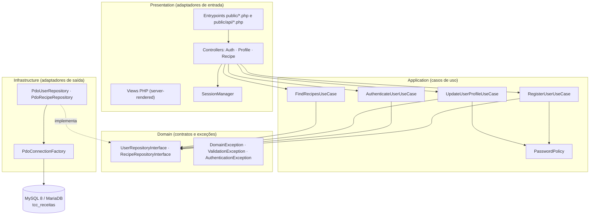
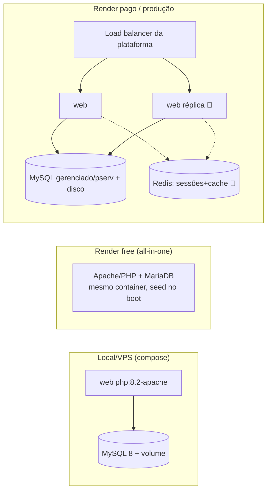

# Documento Técnico — Arquitetura Backend

**Projeto:** Portal Receitas · HomeMadeGourmet
**Escopo:** camada de serviços e regras de negócio (PHP 8.2, Clean Architecture)
**Status:** referência oficial do backend · v2.0
**Complementa:** [architecture.md](architecture.md) (resumo) · [../DEPLOY.md](../DEPLOY.md) (operação) · [../database/DB_Receitas.sql](../database/DB_Receitas.sql) (banco oficial)

Este documento descreve **o que está implementado hoje** (marcado ✅), **as justificativas de cada decisão** e **a evolução recomendada** (marcado 🔭). Tudo o que está marcado ✅ é verificável no código.

---

## Sumário

1. [Visão geral e requisitos](#1-visão-geral-e-requisitos)
2. [Arquitetura geral](#2-arquitetura-geral)
3. [Estrutura de diretórios e módulos](#3-estrutura-de-diretórios-e-módulos)
4. [Domínio e regras de negócio](#4-domínio-e-regras-de-negócio)
5. [SOLID, Clean Code e Design Patterns](#5-solid-clean-code-e-design-patterns)
6. [API](#6-api)
7. [Autenticação, autorização e RBAC](#7-autenticação-autorização-e-rbac)
8. [Segurança](#8-segurança)
9. [Tratamento de erros, logs e auditoria](#9-tratamento-de-erros-logs-e-auditoria)
10. [Observabilidade e monitoramento](#10-observabilidade-e-monitoramento)
11. [Dados: banco, cache, filas e eventos](#11-dados-banco-cache-filas-e-eventos)
12. [Escalabilidade, disponibilidade e tolerância a falhas](#12-escalabilidade-disponibilidade-e-tolerância-a-falhas)
13. [Estratégia de testes](#13-estratégia-de-testes)
14. [Containers, CI/CD e deploy](#14-containers-cicd-e-deploy)
15. [Configuração e variáveis de ambiente](#15-configuração-e-variáveis-de-ambiente)
16. [Governança e evolução contínua](#16-governança-e-evolução-contínua)
17. [Registro de decisões arquiteturais (ADRs)](#17-registro-de-decisões-arquiteturais-adrs)
18. [Roadmap técnico](#18-roadmap-técnico)

---

## 1. Visão geral e requisitos

### 1.1 O sistema

Portal de receitas com catálogo público, busca por ingrediente, filtro por categoria, contas de usuário (cadastro/login/perfil) e vídeo por receita. Backend em **PHP 8.2** sem framework, organizado em **Clean Architecture**, servindo páginas server-rendered e uma **API JSON de autenticação**.

### 1.2 Requisitos funcionais (RF) ✅

| # | Requisito | Implementação |
|---|-----------|---------------|
| RF01 | Listar receitas com foto, tempo, categoria | `FindRecipesUseCase` + `RecipeController::list` |
| RF02 | Buscar receitas por ingrediente | `PdoRecipeRepository::buildFilters` (LIKE parametrizado nas 15 colunas) |
| RF03 | Filtrar por categoria | idem, condição `idcategoriaFK = :categoryId` |
| RF04 | Exibir detalhe (vídeo, ingredientes, preparo, porções, calorias) | `FindRecipesUseCase::mapDetail` |
| RF05 | Cadastrar usuário | `RegisterUserUseCase` via `POST /api/register.php` |
| RF06 | Autenticar usuário | `AuthenticateUserUseCase` via `POST /api/login.php` |
| RF07 | Editar perfil (nome/e-mail/senha) | `UpdateUserProfileUseCase` via `POST /profile.php` |
| RF08 | Encerrar sessão | `AuthController::logout` / `POST /api/logout.php` |
| RF09 | Consultar sessão atual | `GET /api/me.php` (rota protegida) |

### 1.3 Requisitos não funcionais (RNF)

| # | Requisito | Estado |
|---|-----------|--------|
| RNF01 | Senhas exclusivamente em hash bcrypt | ✅ `password_hash`/`password_verify` + CHECK no banco (≥60 chars) |
| RNF02 | 100% das queries parametrizadas | ✅ PDO com `EMULATE_PREPARES = false` |
| RNF03 | Política de senha (≥8, letra e número) | ✅ `PasswordPolicy` |
| RNF04 | Sessão resistente a fixation/XSS | ✅ cookie `HttpOnly`+`SameSite=Lax`(+`Secure`), `session_regenerate_id` |
| RNF05 | Resposta amigável com banco indisponível | ✅ handler 503 nos entrypoints |
| RNF06 | Health check sem dependência do banco | ✅ `GET /healthz.php` |
| RNF07 | Deploy reprodutível com um comando | ✅ Docker/compose/render.yaml |
| RNF08 | Testes automatizados das regras de negócio | ✅ PHPUnit 20 testes |
| RNF09 | Configuração 100% por ambiente | ✅ `config/bootstrap.php` lê env com fallbacks |
| RNF10 | p95 < 300 ms nas rotas de leitura (single node) | 🔭 formalizar medição (ver §10) |

---

## 2. Arquitetura geral

### 2.1 Estilo arquitetural ✅

**Clean Architecture / arquitetura em camadas**, com a regra de dependência apontando sempre para dentro:



**Justificativa:** o núcleo (Domain + Application) não conhece PDO, HTTP nem sessão — pode ser testado com fakes em memória (é exatamente o que `tests/Support/InMemoryUserRepository` faz) e sobreviveria à troca do mecanismo de entrega (CLI, fila, outro protocolo) sem alteração.

### 2.2 Fluxo de uma requisição (login) ✅

```mermaid
sequenceDiagram
    participant B as Navegador
    participant E as public/api/login.php
    participant AC as AuthController
    participant UC as AuthenticateUserUseCase
    participant UR as PdoUserRepository
    participant DB as MySQL/MariaDB
    participant SM as SessionManager

    B->>E: POST /api/login.php {email, senha}
    E->>E: valida método + decodifica JSON
    E->>AC: login(input)
    AC->>UC: execute(email, senha)
    UC->>UR: findByEmail(email)
    UR->>DB: SELECT ... WHERE emailUsuario = :email (prepared)
    DB-->>UR: linha do usuário
    UR-->>UC: array|null
    UC->>UC: password_verify(senha, hash)
    alt credenciais válidas
        UC-->>AC: usuário
        AC->>SM: start() + regenerate() + set(sessão)
        AC-->>E: {status: 200, body: {detail, nome}}
        E-->>B: 200 + Set-Cookie (HttpOnly; SameSite=Lax)
    else inválidas
        UC-->>AC: AuthenticationException
        AC-->>E: {status: 401, body: {detail}}
        E-->>B: 401 {"detail":"Senha ou e-mail incorretos."}
    end
```

### 2.3 Composition Root ✅

Toda a montagem de dependências acontece em **um único lugar**: `config/bootstrap.php`. Ele lê o ambiente, instancia a factory de conexão, os repositórios, os use cases e os controllers, e devolve o contêiner (array de serviços). Nenhuma classe cria as próprias dependências — todas as recebem pelo construtor (injeção de dependência manual, sem contêiner mágico).

---

## 3. Estrutura de diretórios e módulos ✅

```
├─ public/                    ← ÚNICA superfície exposta pelo Apache
│  ├─ index|login|register|profile.php   (entrypoints de página)
│  ├─ healthz.php                        (probe de vida)
│  └─ api/                               (entrypoints JSON)
│     ├─ _bootstrap.php                  (headers, parse de JSON, apiRespond)
│     └─ register|login|logout|me.php
├─ src/
│  ├─ Domain/                 ← contratos + exceções (zero dependências)
│  ├─ Application/            ← use cases + validação (depende só do Domain)
│  ├─ Infrastructure/         ← PDO (depende do Domain; implementa contratos)
│  └─ Presentation/           ← controllers, sessão, views (depende da Application)
├─ config/bootstrap.php       ← composition root
├─ tests/                     ← Unit/ + Support/ (fakes)
└─ database/DB_Receitas.sql   ← banco oficial (schema, rotinas, seed, DCL, testes)
```

Regras de módulo: **entrypoints não contêm lógica** (só orquestram controller + view/JSON); **controllers não contêm SQL**; **use cases não conhecem HTTP**; **repositórios não contêm regra de negócio**.

---

## 4. Domínio e regras de negócio

### 4.1 Linguagem ubíqua (DDD) ✅

O vocabulário do domínio é preservado do banco até a interface: `usuario`, `receita`, `categoria`, "categoria favorita", "modo de preparo", "porções". As exceções de domínio falam a língua do negócio (`ValidationException('E-mail já existente…')`).

### 4.2 Regras de negócio e onde vivem ✅

| Regra | Local (única fonte) |
|-------|---------------------|
| Senha ≥ 8 caracteres, com letra e número | `Application\Validation\PasswordPolicy` |
| E-mail deve ser único | `RegisterUserUseCase` (pré-verificação) + `uq_usuario_email` (garantia final no banco) |
| E-mail em formato válido | use cases (`filter_var`) + `ck_usuario_email`/trigger (defesa em profundidade) |
| Cadastro exige categoria favorita | `RegisterUserUseCase` |
| Credencial inválida → mensagem genérica | `AuthController` (não vaza qual campo errou) |
| Perfil só para autenticados | `ProfileController::handle` (guard de sessão) |
| Busca vazia exige termo ou categoria | `FindRecipesUseCase::validateSearchRequest` |
| Toda mutação de conta é auditada | triggers `trg_usuario_after_*` → `auditoria_usuario` |

**Padrão adotado:** validação na aplicação (feedback rápido e claro) **e** constraint no banco (garantia sob concorrência e contra bypass) — defesa em profundidade, nunca só uma das duas.

### 4.3 Evolução DDD 🔭

O domínio hoje trafega `array` associativo (herança do PHP procedural). Próximo passo natural, sem quebrar contratos: introduzir **entidades tipadas** (`User`, `Recipe`) e **Value Objects** (`Email`, `PasswordHash`) retornados pelos repositórios — os testes de fake já dão a rede de segurança para essa migração.

---

## 5. SOLID, Clean Code e Design Patterns

### 5.1 SOLID aplicado ✅

- **S**RP — cada use case faz uma coisa; `PasswordPolicy` só valida senha; entrypoints só orquestram.
- **O**CP — novos repositórios (ex.: cache) entram implementando as interfaces do Domain, sem tocar os use cases.
- **L**SP — `InMemoryUserRepository` (testes) substitui `PdoUserRepository` sem nenhum ajuste nos use cases.
- **I**SP — interfaces enxutas e segregadas (`UserRepositoryInterface` ≠ `RecipeRepositoryInterface`).
- **D**IP — Application depende de abstrações do Domain; o concreto (PDO) é injetado no composition root.

### 5.2 Padrões de projeto em uso ✅

| Padrão | Onde | Por quê |
|--------|------|---------|
| **Repository** | `Pdo*Repository` + interfaces | isola persistência do domínio |
| **Factory (lazy singleton)** | `PdoConnectionFactory` | uma conexão por request, criada sob demanda |
| **Composition Root / DI manual** | `config/bootstrap.php` | dependências explícitas, sem magia |
| **Front Controller (por recurso)** | `public/api/_bootstrap.php` | headers, parsing e resposta uniformes |
| **Null Object implícito** | `findByEmail(): ?array` | ausência modelada, sem exceção para fluxo normal |
| **Guard Clause** | use cases | validações no topo, caminho feliz linear |
| **Template de resposta** | `['status' =>, 'body' =>]` | controllers testáveis sem tocar em `http_response_code` |

---

## 6. API

### 6.1 Contrato atual ✅

Estilo **REST pragmático** (recursos como scripts PHP — convenção da plataforma), **JSON UTF-8**, erros no formato `{"detail": string}` (compatível com o padrão do AuthService/FastAPI usado como referência).

| Endpoint | Método | Autentica? | Sucesso | Erros |
|----------|--------|-----------|---------|-------|
| `/api/register.php` | POST | — | `201 {detail, email}` | `400 {detail}` validação · `405` · `503` |
| `/api/login.php` | POST | — | `200 {detail, nome}` + cookie | `401 {detail}` · `405` · `503` |
| `/api/me.php` | GET | ✅ sessão | `200 {id, nome, email}` | `401 {detail}` |
| `/api/logout.php` | POST | — | `200 {detail}` | `405` |
| `/healthz.php` | GET | — | `200 ok` (texto) | — |

Entrada: JSON no corpo (`Content-Type: application/json`) com fallback para `application/x-www-form-urlencoded`. Métodos errados recebem `405` (`apiRequireMethod`).

### 6.2 Versionamento 🔭

Contrato atual é v1 implícito. Quando houver breaking change, adotar **versionamento por caminho** (`/api/v1/...`) — trivial no Apache (subpasta) e explícito para clientes. Mudanças aditivas (novos campos) não versionam.

### 6.3 Documentação de API 🔭

Formalizar o contrato acima em **OpenAPI 3.1** (`docs/openapi.yaml`), habilitando: documentação navegável (Swagger UI/Redoc), geração de clientes e **testes de contrato** (§13). A tabela §6.1 é a fonte para essa especificação.

### 6.4 GraphQL — decisão: não adotar ✅

Com 5 endpoints e agregados rasos, GraphQL adicionaria complexidade (schema, resolvers, N+1, cache) sem benefício. Reavaliar apenas se surgirem múltiplos clientes com necessidades de projeção distintas.

---

## 7. Autenticação, autorização e RBAC

### 7.1 Mecanismo: sessão com cookie endurecido ✅ (ADR-002)

Autenticação por **sessão PHP** com cookie `HttpOnly` + `SameSite=Lax` + `Secure` (atrás de HTTPS/proxy, detectado por `X-Forwarded-Proto`), com `session_regenerate_id(true)` pós-login (anti-fixation).

**Por que sessão e não JWT?** O consumidor é o próprio site (same-origin). Cookie HttpOnly é imune a exfiltração por XSS (JS não lê o token), tem revogação imediata (destruir a sessão) e zero gestão de expiração no cliente. JWT brilha em APIs para terceiros/mobile — que é o caso do AuthService de referência, não deste portal. A **semântica** do fluxo do AuthService (endpoints, códigos, mensagens) foi preservada; só o transporte do token difere, por segurança.

### 7.2 Autorização ✅ / RBAC 🔭

- **Aplicação (hoje):** dois níveis — anônimo (catálogo, cadastro, login) e autenticado (perfil, `/api/me`). Guard centralizado no `ProfileController` e no `me()`.
- **Banco (hoje):** RBAC real com papéis `papel_leitura` e `papel_aplicacao` + usuários `portal_app`/`portal_relatorios` sob menor privilégio (a aplicação não recebe DELETE nem DDL) — seção 15 do `DB_Receitas.sql`.
- 🔭 **RBAC na aplicação:** quando surgir área administrativa (gerir receitas), adicionar coluna `perfil` (`usuario`/`admin`) na tabela `usuario`, expor no `me()` e criar guard `requireRole('admin')` no ponto único (`_bootstrap.php`).

---

## 8. Segurança

Mapeamento contra o **OWASP Top 10** (o que se aplica ao escopo):

| Risco | Mitigação ✅ |
|-------|--------------|
| **Injeção (SQLi)** | 100% prepared statements, `EMULATE_PREPARES=false`; nenhuma concatenação de entrada em SQL |
| **Quebra de autenticação** | bcrypt, mensagem genérica de erro, regenerate de sessão, cookie endurecido, política de senha |
| **XSS** | saída HTML via `htmlspecialchars`; payloads JS via `json_encode`; token de sessão inacessível a JS (HttpOnly) |
| **CSRF** | `SameSite=Lax` bloqueia POST cross-site; API só aceita métodos esperados (405) |
| **Exposição de dados** | view `vw_usuario_publico` sem hash; auditoria sem senha; logs sem credenciais |
| **Log Injection** | sanitização de `\r\n` antes de logar e-mails (`AuthController::sanitizeLog`) |
| **Componentes vulneráveis** | superfície mínima: zero dependências de produção no Composer |
| **Config insegura** | `php.ini-production` na imagem; docroot restrito a `public/`; credenciais só por env |
| **Falhas de integridade** | CHECKs, FKs, UNIQUE e triggers no banco (defesa em profundidade) |

**Validação e sanitização ✅:** entrada validada nos use cases (tipo, formato, obrigatoriedade — `filter_var`, `PasswordPolicy`, trim); saída sempre escapada no contexto correto (HTML/JSON). Sanitização não substitui validação — ambas existem.

**Endurecimento adicional 🔭 (ordem de valor):**
1. **Rate limiting** no login/cadastro (ex.: 10 tentativas/min por IP — na plataforma ou tabela de tentativas) — mitiga força bruta, hoje o principal gap;
2. **Cabeçalhos de resposta**: `Content-Security-Policy` (permitindo apenas YouTube/fonts usados), `X-Frame-Options: DENY`, `Referrer-Policy`;
3. **Token anti-CSRF** explícito no form do perfil (defesa extra além do SameSite);
4. `password_needs_rehash` no login (migração automática de custo do bcrypt).

---

## 9. Tratamento de erros, logs e auditoria

### 9.1 Erros ✅

Estratégia em três anéis:

1. **Domínio:** exceções tipadas (`ValidationException`, `AuthenticationException`) → convertidas pelos controllers em respostas de negócio (400/401) com mensagem segura;
2. **Infraestrutura:** `PDOException` → capturada nos entrypoints → `503` com página/JSON amigável (`unavailable.php` / `apiUnavailable()`) — o usuário nunca vê stack trace;
3. **Inesperado:** `display_errors` off em produção (`php.ini-production`); erro vai para o log do Apache, não para a tela.

🔭 Extrair o par try/catch dos entrypoints para um `ErrorHandler` único (função no `_bootstrap.php` de páginas, como já existe no de API) — remove a última duplicação.

### 9.2 Logs ✅ / 🔭

- ✅ Eventos de autenticação (tentativa/sucesso/falha de login e cadastro) com e-mail sanitizado, via `error_log` → stdout/stderr do container → `docker compose logs` / log stream da Render.
- 🔭 Evoluir para **logs estruturados** (JSON por linha: `ts`, `evento`, `email`, `ip`, `resultado`) — grep-áveis e prontos para agregadores (Loki/CloudWatch), sem dependência nova.

### 9.3 Auditoria ✅

Trilha **no banco**, à prova de bypass da aplicação: triggers registram INSERT/UPDATE/DELETE de contas em `auditoria_usuario` (quem, quando, se trocou senha — nunca o hash). Consultável via SQL; validada a cada implantação pela seção 17 do script.

---

## 10. Observabilidade e monitoramento

| Pilar | Hoje ✅ | Evolução 🔭 |
|-------|---------|-------------|
| **Health** | `GET /healthz.php` (vivacidade, sem tocar o banco) — usado pelo healthcheck da Render e do compose | `readyz` opcional que testa `SELECT 1` (prontidão) |
| **Logs** | stdout do container (auth + Apache access/error) | logs JSON estruturados; correlação por request-id |
| **Métricas** | implícitas na plataforma (Render: CPU/RAM/latência) | endpoint `/metrics` (contadores de login ok/falha, latência por rota) para Prometheus, ou métricas da plataforma + alertas |
| **Alertas** | — | alerta em: healthcheck falhando, taxa de 5xx, pico de 401 (ataque de força bruta) |
| **Tracing** | desnecessário (monólito, 1 hop de banco) | reavaliar se surgirem serviços |

Princípio: instrumentar o que gera decisão (falhas de login, 5xx, latência de busca), não tudo.

---

## 11. Dados: banco, cache, filas e eventos

### 11.1 Integração com banco ✅

- **PDO** com `ERRMODE_EXCEPTION`, `FETCH_ASSOC`, `EMULATE_PREPARES=false` (prepares nativos), charset `utf8mb4`, TLS opcional (`DB_SSL_CA`/`DB_SSL_VERIFY`) para provedores gerenciados;
- **Uma conexão por request** (factory lazy) — modelo adequado a PHP share-nothing;
- Banco oficial único (`DB_Receitas.sql`): constraints nomeadas, índices dedicados + FULLTEXT, views, functions, procedures, triggers e autoteste de implantação;
- Compatível com **MySQL 8** (compose) e **MariaDB 10.11** (Render free), ambos testados.

### 11.2 Cache 🔭

Em ordem de custo/benefício quando a escala pedir:
1. **HTTP caching de assets** (headers `Cache-Control` no Apache para `assets/` — imagens/CSS/JS são imutáveis por deploy);
2. **Cache de catálogo em APCu** (a lista de receitas muda raramente; TTL 60s eliminaria a maioria das queries de leitura) — decorator `CachedRecipeRepository` implementando `RecipeRepositoryInterface`, sem tocar use cases (OCP);
3. **Redis** apenas quando houver múltiplas instâncias (cache compartilhado + sessões — §12).

### 11.3 Filas, mensageria e eventos 🔭

Hoje não há trabalho assíncrono (nenhum e-mail, nenhum processamento pesado) — **fila agora seria complexidade sem consumidor**. Gatilhos para adotar (nesta ordem: tabela `outbox` + cron → depois broker de verdade):
- envio de e-mail (confirmação de cadastro, reset de senha);
- notificações;
- geração de relatórios pesados.

---

## 12. Escalabilidade, disponibilidade e tolerância a falhas

### 12.1 Modelo atual ✅

- PHP é **share-nothing**: cada request é independente — escala **vertical** imediata (mais CPU/RAM) e **horizontal** quase pronta;
- O **único estado local** é a sessão em arquivo. Para N instâncias atrás de load balancer: trocar por **session handler no Redis** (1 classe + 2 linhas no bootstrap) ou sticky sessions do balanceador;
- Banco: leitura dominante e indexada; margem grande antes de precisar de réplicas.

### 12.2 Topologias de deploy suportadas ✅



### 12.3 Tolerância a falhas ✅ / 🔭

- ✅ Banco fora → **degradação graciosa** (503 amigável, health continua 200 → a instância não é reiniciada em loop por causa do banco);
- ✅ `depends_on: condition: service_healthy` + healthcheck do MySQL no compose (ordem de subida correta);
- ✅ Deadlock/serialização: InnoDB aborta a transação mais barata; documentado no script (SQLSTATE 40001 → retry);
- 🔭 Retry com backoff na **conexão** inicial (banco reiniciando) e circuit breaker se houver dependências externas no futuro;
- 🔭 **Backups**: agendar dump diário (`mysqldump`) no ambiente com persistência; no free da Render o estado é efêmero por design (seed é a fonte).

---

## 13. Estratégia de testes

### 13.1 Pirâmide atual ✅

| Nível | O que cobre | Ferramenta |
|-------|-------------|-----------|
| **Unitário** (rápido, sem I/O) | use cases Register/Authenticate/UpdateProfile, `PasswordPolicy` (força de senha, duplicidade, hash bcrypt nunca em claro) — com `InMemoryUserRepository` | PHPUnit 11 — 20 testes |
| **Integração** | `PdoConnectionFactory` contra MySQL real (conexão, reuso singleton, falha de host) — ativado por `TEST_DB_HOST` | PHPUnit (grupo skippable) |
| **Implantação do banco** | volumetria, FKs, hashes, view atualizável, rotinas, auditoria | seção 17 do `DB_Receitas.sql` (roda a cada import) |
| **E2E** | fluxos completos por HTTP e navegador real (login, cadastro, busca, perfil, modal, mobile) | executados a cada entrega (Playwright ad-hoc) |

### 13.2 Evolução 🔭

1. **Testes de contrato:** validar respostas da API contra o `openapi.yaml` (§6.3) — Schemathesis ou asserções PHPUnit sobre o JSON;
2. **E2E versionado:** mover os scripts Playwright das entregas para `tests/E2E/` com execução opcional no CI;
3. **Carga:** k6 com cenário "home + busca + login" — meta inicial: 100 VUs, p95 < 300 ms, 0 erros; roda antes de mudanças de infraestrutura.

---

## 14. Containers, CI/CD e deploy

### 14.1 Containers ✅

- **Imagem principal** (`Dockerfile`): `php:8.2-apache`, `composer install --no-dev --optimize-autoloader` no build (autoloader garantido), `php.ini-production`, docroot `public/`, porta dinâmica via `PORT` (entrypoint);
- **Variante free** (`docker/render-free.Dockerfile`): Apache/PHP + MariaDB no mesmo container, seed no boot — trade-off documentado (ADR-004);
- **Banco standalone** (`docker/db.Dockerfile`): MySQL 8 com seed embutido para serviço privado com disco.

### 14.2 CI/CD 🔭 (proposta pronta para adotar)

GitHub Actions em dois estágios:

```yaml
# .github/workflows/ci.yml (proposta)
# 1) lint+test: php -l em src/ public/, composer validate, phpunit
# 2) build: docker build das duas imagens (garante que o Dockerfile não regrediu)
```

Deploy contínuo já existe de fato: **push na `main` → auto-deploy da Render** (blueprint). Estratégia de release: a Render faz **rolling deploy** com health check (`/healthz.php`) — instância nova só recebe tráfego saudável; rollback = redeploy do commit anterior.

### 14.3 Estratégia de branches ✅

Trunk-based simplificado: trabalho em branch curta (`portal-receitas-rebuild`) → PR revisado → rebase-merge na `main` (histórico linear) → deploy.

---

## 15. Configuração e variáveis de ambiente ✅

Config **100% por ambiente**, lida apenas no composition root — nenhuma credencial no código ou no versionamento (`.env` no `.gitignore`; `.env.example` documenta):

| Variável | Padrão | Uso |
|----------|--------|-----|
| `DB_HOST` / `DB_PORT` / `DB_NAME` / `DB_USER` / `DB_PASS` | localhost/3306/tcc_receitas/root/vazio | conexão (fallback = XAMPP dev) |
| `DB_SSL_CA` / `DB_SSL_VERIFY` | nulo/true | TLS p/ MySQL gerenciado |
| `PORT` | 80 | porta do Apache (Render injeta) |
| `WEB_PORT` | 8080 | porta publicada no compose |

Princípio 12-factor: mesmo artefato (imagem) em qualquer ambiente; só o ambiente muda.

---

## 16. Governança e evolução contínua ✅

- **Histórico:** `CHANGELOG.md` versionado (semântico: 1.0.0 → 2.0.0), com racional de cada mudança;
- **Qualidade em PR:** toda mudança entra por PR com descrição de validação executada; `main` sempre deployável (testada E2E antes de cada merge);
- **Documentação viva:** este documento + `architecture.md` + comentários de seção no SQL; regra: mudou contrato, muda o doc no mesmo PR;
- **Dívida técnica:** registrada nos itens 🔭 deste documento (fonte única), priorizada por valor/risco.

---

## 17. Registro de decisões arquiteturais (ADRs)

| ADR | Decisão | Justificativa | Trade-off aceito |
|-----|---------|---------------|------------------|
| **001** | PHP 8.2 **sem framework**, Clean Architecture manual | TCC didático: cada camada é visível e explicável; zero dependências de produção; superfície de ataque mínima | sem ferramentas prontas (routing, ORM) — mitigado pelo escopo pequeno |
| **002** | **Sessão HttpOnly** em vez de JWT | consumidor same-origin; token imune a XSS; revogação imediata (§7.1) | não serve a terceiros — se surgir app mobile, adicionar emissor JWT ao lado |
| **003** | Ingredientes em **15 colunas** (legado preservado) | contrato da aplicação e do TCC original; busca parametrizada já auditada | não normalizado — FULLTEXT já criado; migração N:N desenhada no roadmap |
| **004** | **All-in-one** (PHP+MariaDB) no plano free da Render | requisito: custo zero + Docker; plano free não tem disco/serviço privado | dados de runtime efêmeros — aceito para demo; opções com persistência documentadas |
| **005** | Erros de API no formato `{"detail"}` | compatibilidade com o padrão do AuthService (referência adotada) e do FastAPI | — |
| **006** | Validação na aplicação **e** constraint no banco | defesa em profundidade; banco íntegro mesmo sob acesso direto | pequena duplicação de regra, aceita conscientemente |
| **007** | GraphQL **não** adotado | 5 endpoints, agregados rasos (§6.4) | reavaliar com múltiplos clientes |

---

## 18. Roadmap técnico

Ordenado por valor ÷ esforço:

| # | Item | Camadas | Referência |
|---|------|---------|-----------|
| 1 | Rate limiting em login/cadastro | Presentation | §8 |
| 2 | Cabeçalhos CSP/X-Frame-Options/Referrer-Policy | Infra (Apache) | §8 |
| 3 | `docs/openapi.yaml` + testes de contrato | API/testes | §6.3, §13 |
| 4 | CI GitHub Actions (lint + phpunit + docker build) | DevOps | §14.2 |
| 5 | Logs estruturados em JSON | Observabilidade | §9.2 |
| 6 | Cache APCu do catálogo (decorator no repositório) | Infrastructure | §11.2 |
| 7 | Entidades/VOs tipados no Domain | Domain | §4.3 |
| 8 | Sessões em Redis (pré-requisito de escala horizontal) | Infra | §12.1 |
| 9 | RBAC de aplicação + área admin de receitas | todas | §7.2 |
| 10 | Favoritos/avaliações (roadmap do produto) + `receita_ingrediente` N:N | todas | ADR-003 |

---

*Documento gerado como referência oficial da camada backend. Ao alterar contratos, camadas ou decisões (ADRs), atualize este arquivo no mesmo PR da mudança.*
