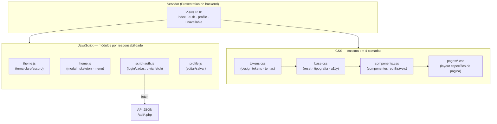
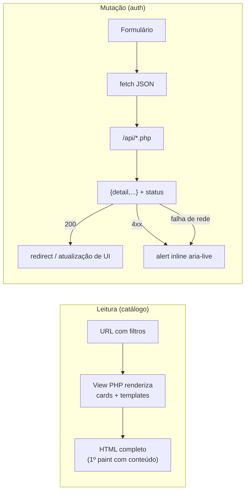

# Documento Técnico — Arquitetura Frontend

**Projeto:** Portal Receitas · HomeMadeGourmet
**Escopo:** camada de apresentação (views PHP server-rendered + Design System CSS + JavaScript vanilla)
**Status:** referência oficial do frontend · v2.0
**Complementa:** [backend.md](backend.md) (serviços/regras de negócio) · [architecture.md](architecture.md) (resumo geral)

Convenção do documento: ✅ implementado e verificável no código · 🔭 evolução recomendada.

---

## Sumário

1. [Visão geral e princípios](#1-visão-geral-e-princípios)
2. [Arquitetura geral do frontend](#2-arquitetura-geral-do-frontend)
3. [Estrutura de diretórios](#3-estrutura-de-diretórios)
4. [Design System](#4-design-system)
5. [Sistema de temas e identidade visual](#5-sistema-de-temas-e-identidade-visual)
6. [Responsividade (Mobile First)](#6-responsividade-mobile-first)
7. [Experiência do Usuário (UX)](#7-experiência-do-usuário-ux)
8. [Interface (UI) e padronização de estilos](#8-interface-ui-e-padronização-de-estilos)
9. [Acessibilidade (WCAG 2.2 AA)](#9-acessibilidade-wcag-22-aa)
10. [Navegação e roteamento](#10-navegação-e-roteamento)
11. [Estado e fluxo de dados](#11-estado-e-fluxo-de-dados)
12. [Integração com a API e tratamento de erros](#12-integração-com-a-api-e-tratamento-de-erros)
13. [Formulários e validação](#13-formulários-e-validação)
14. [Segurança no frontend](#14-segurança-no-frontend)
15. [Performance](#15-performance)
16. [SEO e PWA](#16-seo-e-pwa)
17. [Testes](#17-testes)
18. [Compatibilidade entre navegadores](#18-compatibilidade-entre-navegadores)
19. [Observabilidade e i18n](#19-observabilidade-e-i18n)
20. [Deploy e distribuição](#20-deploy-e-distribuição)
21. [Registro de decisões arquiteturais (ADRs)](#21-registro-de-decisões-arquiteturais-adrs)
22. [Roadmap do frontend](#22-roadmap-do-frontend)

---

## 1. Visão geral e princípios

O frontend é uma **MPA server-rendered** (views PHP) com **progressive enhancement** em JavaScript vanilla e um **Design System próprio** no conceito **Liquid Glass**. Não há framework SPA nem etapa de build — decisão deliberada (ADR-F01).

Princípios que governam a camada:

1. **O HTML chega pronto e com significado** — conteúdo renderizado no servidor, semântico, indexável e acessível antes de qualquer JS executar;
2. **JS melhora, nunca sustenta** — busca e filtros funcionam sem JavaScript (form GET); o JS adiciona modal, tema, skeleton e fetch;
3. **Uma fonte de verdade visual** — todo valor de cor/espaço/tipo/movimento vem de token; nenhum componente inventa estilo;
4. **Estados sempre visíveis** — cada interação tem feedback (loading, sucesso, erro, vazio); o usuário nunca fica sem resposta;
5. **Custo mínimo de manutenção** — zero dependências de runtime; um dev júnior lê qualquer arquivo de ponta a ponta.

---

## 2. Arquitetura geral do frontend

### 2.1 Camadas ✅



**Separação de responsabilidades:** a view define estrutura e conteúdo; o CSS define aparência (por tokens); o JS define comportamento. Nenhuma camada escreve na alçada da outra (JS não injeta estilos inline além de estados; CSS não depende de ordem de scripts).

### 2.2 Componentização sem framework ✅

Componentes são **contratos de marcação + classe CSS + (opcional) comportamento JS**, documentados em `components.css`. Exemplo — o componente botão:

- Marcação: `<button class="btn btn--primary">`;
- Estados: `:hover`, `:focus-visible`, `:active`, `:disabled`, `[aria-busy="true"]` (spinner automático);
- Variantes: `--primary`, `--ghost`, `--soft`, `--icon`.

A reutilização é por composição de classes (mesmo `.chip` serve ao filtro da home e à categoria do cadastro; mesmo `.field` serve a login, cadastro e perfil). Templates repetidos entre páginas (head, header do site) são candidatos a partials PHP (🔭 §22).

---

## 3. Estrutura de diretórios ✅

```
public/assets/
├─ css/
│  ├─ tokens.css          ← 1º nível: design tokens (única fonte de valores)
│  ├─ base.css            ← 2º nível: reset, tipografia, fundações de a11y
│  ├─ components.css      ← 3º nível: componentes reutilizáveis
│  └─ pages/              ← 4º nível: layout por página
│     ├─ home.css
│     ├─ auth.css
│     └─ profile.css
├─ js/
│  ├─ theme.js            ← cross-page (tema)
│  ├─ home.js             ← página home
│  ├─ script-auth.js      ← página de acesso
│  └─ profile.js          ← página de perfil
└─ img/                   ← imagens e ícones de categoria (PNG locais)

src/Presentation/View/     ← templates PHP (estrutura + conteúdo)
```

Regra de dependência do CSS: um arquivo só usa variáveis definidas em níveis anteriores; `pages/*` nunca redefine token. Regra do JS: um arquivo por página + módulos compartilhados; sem globais além dos handlers expostos deliberadamente (`toggleEye`, `loginUser`…).

---

## 4. Design System

### 4.1 Design tokens ✅ (`tokens.css`)

| Grupo | Tokens |
|-------|--------|
| **Cor — marca** | `--color-primary`, `-strong`, `-soft`, `--color-secondary`, `--color-accent` |
| **Cor — feedback** | `success`, `warning`, `error`, `info` (+ variantes `-soft`) |
| **Cor — superfícies** | `bg`, `bg-gradient`, `surface`, `surface-raised`, `surface-overlay`, `border`, `border-strong` |
| **Cor — texto/estados** | `text-primary`, `text-secondary`, `text-muted`, `text-inverse`, `disabled`, `hover`, `focus` + `--focus-ring` |
| **Liquid glass** | `glass-bg`, `glass-bg-strong`, `glass-border`, `glass-inner-light`, `glass-blur`, `glass-blur-soft` |
| **Espaço (8pt grid)** | `--space-1` (4px) … `--space-9` (64px) |
| **Tipografia** | famílias (`Inter` corpo, `Sora` display), escala `--text-xs`…`--text-4xl`, pesos 400–700, `--leading-*`, `--measure` (68ch) |
| **Forma** | raios `sm/md/lg/xl/full` |
| **Elevação** | `--shadow-1`…`--shadow-4` (4 níveis) |
| **Motion** | `--ease-out`, `--ease-spring`, `--dur-fast/base/slow` |
| **Camadas** | `--layer-nav/modal/toast` (z-index disciplinado) |

**Paleta e psicologia das cores:** primário laranja terroso (`#C2410C` claro / `#FB923C` escuro) — apetite e acolhimento, coerente com culinária — escurecido no tema claro para garantir contraste AA sobre superfícies; neutros quentes (fundos off-white/marrom profundo) para credibilidade sem frieza; azul-petróleo como accent para links/informação (confiança).

### 4.2 Componentes ✅ (`components.css`)

`glass` (superfícies), `btn` (4 variantes × 5 estados + loading), `field` (label, ícone, olho de senha, hint), `chip` (rádio de categoria), `card`, `badge`, `alert` (4 severidades, `aria-live`), `modal` (+backdrop), `skeleton`, `empty` (estado vazio), animações compartilhadas (`fade-in/up`, `scale-in`, `shimmer`, `reveal`).

Cada componente lista seus estados no próprio CSS (documentação junto do código). Ícones: **Line Awesome** via CDN (mesma família em todas as telas).

### 4.3 Motion design ✅

Durações e easings tokenizados; microinterações discretas (hover eleva card 4px, `active` comprime botão 3%, chips com spring); entrada dos cards com stagger de 40ms (teto 400ms); skeleton shimmer no feedback de busca. **`prefers-reduced-motion` desliga tudo** (base.css) — animação é sempre progressiva, nunca requisito.

---

## 5. Sistema de temas e identidade visual ✅

- Dois temas completos (claro/escuro) definidos **somente em `tokens.css`** — componentes e páginas não sabem qual tema está ativo;
- Troca por `data-theme` no `<html>`; botão `.js-theme-toggle` presente em todas as telas com `aria-pressed`;
- **Sem FOUC:** snippet inline no `<head>` aplica o tema antes do primeiro paint (lê `localStorage`, cai para `prefers-color-scheme`);
- `color-scheme` declarado (formulários e scrollbars nativos acompanham o tema).

---

## 6. Responsividade (Mobile First) ✅

- Base escrita para mobile; media queries **só com `min-width`** exceto na alternância do painel de acesso;
- Breakpoints em `rem`: 40 (grid de categorias 3→6 colunas), 48 (container mais folgado; painel deslizante do auth vira alternância simples), 56 (modal de receita 1→2 colunas);
- Grid de receitas fluido: `repeat(auto-fill, minmax(15rem, 1fr))` — de 1 coluna (celular) a N (ultrawide), sem breakpoint por dispositivo;
- Container central `min(100% - margens, 76rem)` — conforto em monitores ultrawide;
- `100dvh` (unidades dinâmicas) para altura correta em navegadores móveis;
- **Validado:** 390px sem rolagem horizontal, layout íntegro (teste automatizado `scrollWidth > clientWidth`).

---

## 7. Experiência do Usuário (UX)

Princípios aplicados com exemplos concretos no produto ✅:

| Princípio | Aplicação |
|-----------|-----------|
| **Lei de Hick** | uma ação primária por tela (Buscar / Conectar / Cadastrar / Salvar); menu do usuário com 2 itens |
| **Lei de Fitts** | alvos ≥ 44px (`min-height: 2.75rem` em botões/campos), cards inteiros clicáveis, botão de busca colado ao campo |
| **Nielsen — visibilidade de status** | skeleton ao buscar, `aria-busy` + texto no botão ("Autenticando…"), contagem de resultados |
| **Nielsen — prevenção de erro** | Salvar do perfil só habilita após "Editar dados"; confirmação de senha no cadastro; medidor de força |
| **Nielsen — reconhecimento** | filtros persistem na URL e permanecem marcados após a busca; "Limpar filtros" visível quando há filtro |
| **Gestalt (proximidade/semelhança)** | metadados agrupados no card; chips idênticos entre home e cadastro |
| **Progressive disclosure** | detalhe da receita só no modal; menu do usuário recolhido; painel login⇄cadastro alterna sob demanda |
| **Estados vazios projetados** | busca sem resultado → ilustração + mensagem original + ação de saída ("Ver todas as receitas") |
| **Mensagens de erro claras** | inline, junto do formulário, com texto de causa ("A senha deve conter pelo menos um número.") |
| **Navegação previsível** | logo → home; URLs limpas e compartilháveis; Esc fecha modal e menu |

---

## 8. Interface (UI) e padronização de estilos ✅

- **Nomenclatura BEM simplificada:** bloco (`.recipe-card`), elemento (`.recipe-card__title`), modificador (`.btn--primary`) — grep-ável e sem colisões;
- **Hierarquia tipográfica** única (h1 36px → texto 16px, `Sora` para display, `Inter` para corpo), `--measure: 68ch` limita a largura de leitura;
- **Espaçamento apenas por token** (8pt grid) — sem valores mágicos;
- **Alinhamento**: tudo em grid/flex com `gap` (nada posicionado "no olho");
- Utilitários mínimos (`.container`, `.visually-hidden`, `.skip-link`) — não é um framework utilitário; a semântica fica nas classes de componente.

---

## 9. Acessibilidade (WCAG 2.2 AA) ✅

| Critério | Implementação |
|----------|---------------|
| **Teclado em tudo** | cards são `<button>`; menu do usuário é `<details>` nativo; modal fecha com Esc; nenhum fluxo exige mouse |
| **Foco visível** | `:focus-visible` global com anel de 3px tokenizado; foco **gerenciado** no modal (entra no fechar, volta ao card de origem) |
| **Skip link** | "Pular para o conteúdo" em todas as páginas |
| **Landmarks/roles** | `header[banner]`, `main`, `footer[contentinfo]`, `role="search"`, `role="dialog"` + `aria-modal` |
| **Hierarquia H1–H6** | um `h1` por página; seções com `h2/h3` reais |
| **Formulários** | todo campo com `<label>` (visível ou `.visually-hidden`), `autocomplete`, `aria-describedby` para dicas |
| **Feedback acessível** | alertas com `role="alert"`/`aria-live`; medidor de força com `aria-live="polite"`; botões de olho/tema com `aria-label`/`aria-pressed` |
| **Contraste** | paleta recalculada — texto primário ≥ 7:1, secundário ≥ 4.5:1, botão primário ≥ 4.5:1 nos dois temas |
| **Movimento** | `prefers-reduced-motion: reduce` neutraliza animações e transições |
| **Alvos de toque** | mínimo 44×44px em controles interativos |

🔭 Auditoria periódica com axe-core no fluxo E2E (§17).

---

## 10. Navegação e roteamento ✅

**Roteamento por páginas** (MPA): `index.php` (catálogo/busca), `login.php`/`register.php` (mesma view de acesso, painel inicial diferente), `profile.php`, endpoints `/api/*`. Estado de navegação **na URL** (query string de busca/filtro) — compartilhável, indexável e com histórico do navegador grátis (back/forward funcionam sem JS).

**Justificativa vs SPA:** três páginas, conteúdo majoritariamente estático por request e SEO relevante para o catálogo. Um router client-side adicionaria JS, complexidade de estado e risco de a11y sem nenhum ganho perceptível. (ADR-F01.)

---

## 11. Estado e fluxo de dados

### 11.1 Inventário de estado ✅ (menor estado possível, no dono certo)

| Estado | Dono | Persistência |
|--------|------|--------------|
| Sessão do usuário | **servidor** (PHP session) | cookie HttpOnly (JS não acessa) |
| Filtros/busca ativos | **URL** (query string) | histórico do navegador |
| Tema claro/escuro | `localStorage` (`hmg_theme`) | entre visitas |
| Modal aberto / menu aberto / campos habilitados | **DOM** (classes/atributos) | efêmero |

Não existe store global em JS — não há estado compartilhado entre páginas que o justifique. Essa é a forma mais simples que atende (KISS) e elimina classes inteiras de bugs de sincronização.

### 11.2 Fluxo de dados ✅



Leituras chegam renderizadas (LCP com conteúdo real); mutações usam a API JSON com feedback otimista de loading e resposta inline.

---

## 12. Integração com a API e tratamento de erros ✅

- Contrato: JSON com `{"detail": string}` em erros (espelha o backend §6 de [backend.md](backend.md));
- Todo `fetch` tem: estado de loading no botão (`aria-busy` + rótulo), tratamento de status HTTP (mensagem do `detail`) e **catch de falha de rede** ("Falha de conexão. Tente novamente.") — os três caminhos sempre terminam em feedback visível;
- Banco indisponível → páginas recebem 503 com a tela amigável autocontida (`unavailable.php`, sem dependências externas — funciona mesmo com tudo fora);
- Erros de guard (não autenticado) → redirect para `login.php?erro=true`, que renderiza o aviso já no HTML (funciona sem JS).

---

## 13. Formulários e validação ✅

**Dupla camada, servidor como autoridade:**

1. **Cliente (UX):** campos obrigatórios, senhas coincidem, categoria selecionada, medidor de força em tempo real — feedback imediato sem round-trip;
2. **Servidor (verdade):** `PasswordPolicy`, formato de e-mail, unicidade — o cliente **nunca** é confiado; a resposta 400 do servidor é exibida no mesmo alerta inline.

Detalhes: `autocomplete` correto (`current-password`/`new-password` — integra com gerenciadores de senha), Enter submete, olho de senha com estado no ícone, dica de requisito no `placeholder` + `aria-describedby`.

---

## 14. Segurança no frontend ✅

| Vetor | Mitigação |
|-------|-----------|
| **XSS por dados do usuário** | toda saída dinâmica escapada com `htmlspecialchars` nas views; JS usa `textContent` (nunca `innerHTML` com dado de usuário) |
| **Roubo de sessão via JS** | token em cookie **HttpOnly** — inacessível a script; nada sensível em `localStorage` (só o tema) |
| **CSRF** | cookie `SameSite=Lax`; mutações só por POST |
| **Conteúdo de terceiros** | únicos embeds são iframes do YouTube vindos do banco (fonte controlada), com `loading="lazy"`; fontes/ícones por CDN conhecido |
| **Clickjacking / política de origem** | 🔭 cabeçalhos `Content-Security-Policy` e `X-Frame-Options` (item 2 do roadmap do backend) |

Controle de acesso **não** é decidido no cliente: guards são server-side (redirect); o front apenas reflete o estado (`/api/me` para saber quem está logado).

---

## 15. Performance

### 15.1 Otimizações implementadas ✅

| Técnica | Implementação | Efeito |
|---------|---------------|--------|
| **Lazy de iframes (a grande vitória)** | os 36 embeds do YouTube vivem em `<template>` inertes; o iframe só entra no DOM ao abrir a receita e é removido ao fechar | de 36 iframes no load para **0**; economia de MBs e de main-thread |
| **Lazy de imagens** | `loading="lazy"` + `width/height` (sem layout shift) em todos os cards | só baixa o que entra na viewport |
| **Code splitting natural** | JS por página (home/auth/profile/theme), todos `defer` | cada rota carrega só o que usa; sem parser-blocking |
| **Fontes** | `preconnect` + `display=swap` | texto visível imediatamente |
| **Zero framework** | CSS+JS totais na ordem de dezenas de KB | TTI ≈ FCP |
| **Renderização** | conteúdo server-rendered (LCP é o próprio catálogo); animações só de `transform/opacity` (compositor) | Core Web Vitals saudáveis |

### 15.2 Próximos ganhos 🔭

1. `Cache-Control` imutável para `assets/` (Apache) + versionamento por query (`?v=`) — repeat views quase instantâneas;
2. Converter PNGs das receitas para **WebP/AVIF** com `srcset` (maior payload restante);
3. Self-host das fontes e do subset de ícones usados (elimina 2 origens de terceiros);
4. Medição contínua: Lighthouse CI no pipeline com orçamento (perf ≥ 95).

---

## 16. SEO e PWA

### 16.1 SEO ✅

HTML semântico com hierarquia H1–H6; `<title>` e `meta description` por página; **Open Graph + Twitter Card**; `theme-color`; favicon; **JSON-LD** (`WebSite`); `robots.txt` (bloqueando `/api/` e perfil) e `sitemap.xml`; páginas privadas com `noindex`; conteúdo do catálogo 100% renderizado no servidor (indexável sem executar JS).

🔭 JSON-LD `Recipe` por receita (rich results de receitas no Google) — os dados já existem no modal.

### 16.2 PWA — decisão: ainda não ✅/🔭

Manifest + service worker só valem quando houver caso de uso offline/instalável real. Para o TCC, o custo (invalidação de cache do SW, atualização de versão) supera o ganho. Se adotado: manifest + SW *cache-first* apenas para assets, *network-first* para HTML.

---

## 17. Testes

- ✅ **E2E em navegador real** (Chromium/Playwright) a cada entrega: login → home → modal (iframe sob demanda: 0→1→0) → tema → perfil → cadastro pela UI → viewport 390px sem overflow. Resultados registrados nos PRs;
- ✅ Regras de negócio dos formulários testadas no backend (PHPUnit — a validação autoritativa);
- 🔭 Versionar os cenários Playwright em `tests/E2E/` e rodar no CI (com axe-core para a11y automatizada);
- 🔭 Unit JS: a lógica pura extraível (score de força de senha) é a única candidata — mover para função pura e testar.

---

## 18. Compatibilidade entre navegadores ✅

Recursos modernos usados e cobertura (todos os evergreen atuais):

| Recurso | Uso | Fallback |
|---------|-----|----------|
| `backdrop-filter` | superfícies glass | com prefixo `-webkit-` (Safari); sem suporte → fundo semiopaco legível (as cores base não dependem do blur) |
| `<template>`/`<details>` | modal e menu | suporte universal desde 2020 |
| `100dvh` | alturas móveis | navegadores antigos tratam como `vh` (degradação aceitável) |
| `color-mix()` | bordas de alerts | sem suporte → borda transparente (alert continua legível pelo fundo) |
| CSS nesting **não** usado | — | compatibilidade máxima do CSS plano |

Nada de JS transpilado: sintaxe usada (ES2020: optional chaining, `replaceChildren`) coberta por todos os navegadores suportados.

---

## 19. Observabilidade e i18n

- 🔭 **Erros de runtime JS:** handler global `window.onerror`/`unhandledrejection` enviando lote para um endpoint de log (ou Sentry) — hoje o JS é pequeno o bastante para o risco ser baixo, mas é o primeiro passo quando a superfície crescer;
- **i18n:** produto pt-BR por definição (TCC) ✅. Strings de UI já estão concentradas nas views (server-side) — extração para arquivo de mensagens é mecânica se um segundo idioma surgir 🔭.

---

## 20. Deploy e distribuição ✅

Assets estáticos são servidos pelo mesmo Apache do container (docroot `public/`) — **um artefato, um deploy** (ver [backend.md §14](backend.md)). Sem build step: o que está no repositório é o que roda. 🔭 Com CDN na frente (Cloudflare), os headers de cache da §15.2 tornam a distribuição global trivial.

---

## 21. Registro de decisões arquiteturais (ADRs)

| ADR | Decisão | Justificativa | Trade-off aceito |
|-----|---------|---------------|------------------|
| **F01** | **Vanilla (sem framework SPA, sem build)** | 3 páginas, conteúdo server-rendered, SEO relevante; zero dependências = zero manutenção de toolchain; didático para o TCC; performance máxima por ausência | sem componentes JSX/SFC — mitigado pelo DS em CSS; **critério de reversão:** se surgirem telas ricas em estado (admin, favoritos em tempo real), adotar ilhas de interatividade (ex.: Preact/petite-vue) antes de um SPA completo |
| **F02** | **Sem TypeScript** (consequência de F01: sem build) | manter o pipeline "arquivo = produção" | sem tipagem estática — mitigado com JSDoc nos módulos e contratos de API documentados; TS entra junto com F01 se revertido |
| **F03** | **Tokens CSS como única fonte visual** | temas e consistência sem tooling; auditável com grep | duplicação teórica entre temas — aceitável (2 temas) |
| **F04** | **Detalhe de receita em `<template>` + modal único** | performance (0 iframes no load) e a11y centralizada num só dialog | conteúdo do modal não tem URL própria — 🔭 `history.pushState` com `#receita-N` se deep-link for desejado |
| **F05** | **Estado na URL/DOM/servidor, sem store JS** | menor estado possível, no dono certo (§11) | — |
| **F06** | **Ícones e fontes via CDN** | simplicidade; caches quentes | dependência de terceiros — 🔭 self-host (§15.2) |

---

## 22. Roadmap do frontend

Priorizado por valor ÷ esforço:

| # | Item | Referência |
|---|------|-----------|
| 1 | `Cache-Control` para assets + versionamento (`?v=`) | §15.2 |
| 2 | Partials PHP para head/header (remove última duplicação entre views) | §2.2 |
| 3 | Imagens WebP/AVIF com `srcset` | §15.2 |
| 4 | E2E Playwright versionado em `tests/E2E/` + axe-core no CI | §17 |
| 5 | JSON-LD `Recipe` por receita (rich results) | §16.1 |
| 6 | Self-host de fontes/ícones | §15.2, ADR-F06 |
| 7 | Deep-link do modal de receita (`#receita-N`) | ADR-F04 |
| 8 | Handler global de erros JS → log | §19 |
| 9 | Lighthouse CI com orçamento de performance | §15.2 |
| 10 | PWA (manifest + SW) — somente com caso de uso real | §16.2 |

---

*Documento gerado como referência oficial da camada frontend. Ao alterar o Design System, contratos de componente ou decisões (ADRs), atualize este arquivo no mesmo PR da mudança.*
