# Guia de Migração — React + Supabase + n8n

> Documentação oficial de arquitetura para a migração do **Portal de Receitas**
> da stack tradicional (React → Node/Express → Banco) para uma arquitetura
> **BaaS + automação** (React na Vercel → Supabase → n8n).
>
> Público-alvo: engenheiros fazendo onboarding e tech leads tomando decisões de
> produção. Cada decisão traz justificativa, trade-offs e alternativas.

## Premissas adotadas

Antes de prosseguir, declaro as premissas que preenchem lacunas do enunciado —
elas valem para todo o documento:

1. **Origem do dado.** O Portal existente é um monólito PHP (Clean Architecture)
   sobre MySQL/MariaDB. O schema abaixo é **reescrito em PostgreSQL nativo** do
   Supabase; não é uma tradução linha a linha do SQL MySQL.
2. **Identidade.** A autenticação passa a ser do **Supabase Auth** (`auth.users`).
   A tabela de domínio `public.users` (perfil público) referencia `auth.users(id)`
   por FK — não duplicamos senha nem e-mail sensível.
3. **Escopo do frontend.** SPA em **React 18 + TypeScript + Vite**, hospedada na
   **Vercel**. Estado de servidor com **TanStack Query**; roteamento com
   **React Router v6**.
4. **Ambientes.** Três projetos Supabase (`local` via CLI, `staging`, `prod`) e
   três deploys Vercel (Preview por PR, Staging, Production).
5. **Custo.** O alvo inicial é o **free tier** de Supabase e Vercel; onde um
   recurso exigir plano pago, isso é sinalizado.
6. **Versões de referência.** Supabase JS `v2`, `@tanstack/react-query` `v5`,
   `react-router-dom` `v6`, n8n `>= 1.x`, Node `>= 20` (Edge Functions em Deno).

---

## Índice

- [6.1. Introdução](#61-introdução)
- [6.2. Comparação de arquiteturas](#62-comparação-de-arquiteturas)
- [6.3. Fluxo de dados](#63-fluxo-de-dados)
- [6.4. Estrutura do projeto](#64-estrutura-do-projeto)
- [6.5. Banco de dados](#65-banco-de-dados)
- [6.6. Modelagem](#66-modelagem)
- [6.7. Supabase Auth](#67-supabase-auth)
- [6.8. Storage](#68-storage)
- [6.9. Realtime](#69-realtime)
- [6.10. Edge Functions](#610-edge-functions)
- [6.11. Segurança](#611-segurança)
- [6.12. Integração com React](#612-integração-com-react)
- [6.13. n8n](#613-n8n)
- [6.14. Automações](#614-automações)
- [6.15. Integração com IA](#615-integração-com-ia)
- [6.16. Deploy](#616-deploy)
- [6.17. Monitoramento](#617-monitoramento)
- [6.18. Escalabilidade](#618-escalabilidade)
- [6.19. Boas práticas](#619-boas-práticas)
- [6.20. Projeto final](#620-projeto-final)
- [6.21. Roadmap](#621-roadmap)
- [6.22. Checklist](#622-checklist)

---

## 6.1. Introdução

### O que é Backend as a Service (BaaS)

**BaaS** é um modelo em que capacidades tradicionalmente construídas no backend —
banco de dados, autenticação, storage de arquivos, APIs, tempo real — são
oferecidas como serviço gerenciado, acessível diretamente do cliente por SDK,
sem você operar servidores. O problema que resolve: **eliminar o esforço
repetitivo de escrever e manter um CRUD/auth/upload seguro**, deixando a equipe
focar no domínio (receitas, avaliações, moderação) em vez de encanamento.

O risco que introduz: **acoplamento ao fornecedor** e perda de controle sobre a
camada de dados. Por isso a escolha exige justificativa (ver 6.1 "quando não
adotar").

### O que é Supabase

Supabase é uma plataforma BaaS **open source** construída sobre **PostgreSQL**.
Diferente de BaaS proprietários (ex.: Firebase), o núcleo é um banco relacional
real, o que preserva integridade referencial, SQL, transações e portabilidade.
Componentes usados neste guia:

| Componente | Papel no Portal de Receitas |
|---|---|
| **PostgreSQL** | Fonte da verdade: receitas, ingredientes, avaliações, etc. |
| **Auth** | Cadastro/login de usuários, JWT, OAuth Google/GitHub |
| **Storage** | Fotos de receitas e avatares |
| **Realtime** | Comentários e notificações ao vivo |
| **Edge Functions** | Lógica server-side confiável (ex.: gerar tags via IA) |
| **PostgREST** | API REST automática derivada do schema |
| **RLS** | Autorização na borda do banco (quem lê/escreve o quê) |

### O que é n8n

n8n é uma ferramenta de **automação de workflows** (orquestração), open source e
auto-hospedável. Modela integrações como grafos de nós (trigger → transformações
→ ações). No Portal, o n8n cobre o que **não** deve morar no caminho síncrono da
requisição: enviar e-mail de boas-vindas, notificar moderadores de uma denúncia,
sincronizar métricas, disparar IA de moderação. O problema que resolve:
**desacoplar efeitos colaterais** da experiência do usuário e evitar reescrever
integrações a cada novo canal (Discord, Telegram, Slack).

### Quando esta arquitetura é adequada

- Times pequenos/médios que precisam de **velocidade** e não querem operar infra.
- Produtos **CRUD-intensivos com regras de acesso claras** (o Portal é exatamente
  isto: recursos por dono, leitura pública, moderação).
- Necessidade de **tempo real** e **auth pronta** sem construir do zero.
- Orçamento inicial baixo (free tiers generosos).

### Quando NÃO adotar

| Cenário | Por quê | O que usar |
|---|---|---|
| Regras de negócio muito complexas e transacionais entre muitos serviços | RLS e PostgREST favorecem CRUD; lógica pesada vaza para Edge Functions e vira difícil de testar | Backend próprio (NestJS) + Postgres gerenciado |
| Requisito de *multi-cloud* ou *on-premise* estrito | Acoplamento ao Supabase gerenciado | Postgres + serviços self-hosted |
| Latência ultrabaixa com lógica no mesmo processo do dado | Saltos cliente→PostgREST→RLS somam latência | Backend co-localizado / stored procedures |
| Domínio com forte modelagem de agregados/DDD e invariantes ricas | Difícil impor invariantes só com policies | Backend com camada de aplicação dedicada |

> **Decisão para o Portal:** a arquitetura BaaS é adequada — o domínio é
> CRUD + moderação + social (follows, notificações), com autorização expressável
> em RLS. A lógica que **não** cabe em policy (IA, e-mails, integrações) vai para
> Edge Functions (confiável, síncrona) ou n8n (assíncrona, orquestração).

---

## 6.2. Comparação de arquiteturas

### Tradicional vs. Moderna

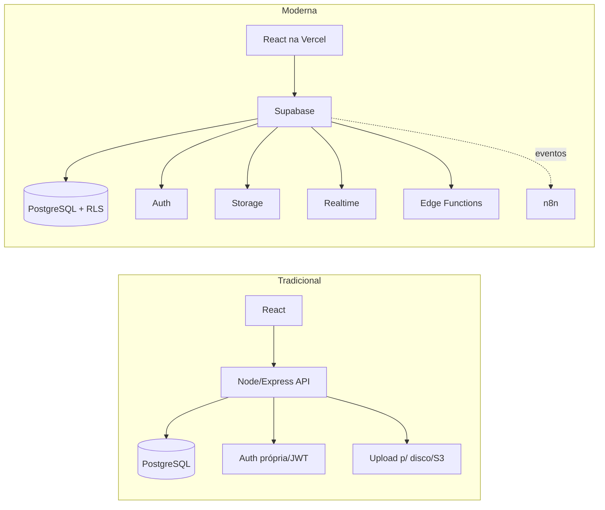

| Critério | Tradicional (React→Node→DB) | Moderna (React→Supabase→n8n) |
|---|---|---|
| **Time-to-market** | Lento: CRUD, auth e upload feitos à mão | Rápido: recursos prontos |
| **Autorização** | No código da API (fácil esquecer um check) | **RLS no banco** (falha fecha, não abre) |
| **Tempo real** | WebSocket/Socket.io manual | Nativo (`postgres_changes`) |
| **Ops/infra** | Você opera servidores, escala, faz backup | Gerenciado |
| **Custo inicial** | Servidor sempre ligado | Free tier; paga ao crescer |
| **Controle/Portabilidade** | Total | Acoplamento ao fornecedor (mitigável: é Postgres) |
| **Lógica complexa** | Natural na camada de aplicação | Vaza p/ Edge Functions; pode ficar espalhada |
| **Testabilidade** | Testes de unidade/integração maduros | Policies e SQL exigem testes de banco (pgTAP) |
| **Vendor lock-in** | Baixo | Médio (schema é Postgres puro; Auth/Storage são específicos) |
| **Latência** | 1 salto lógico | Cliente→PostgREST→RLS; mitigável com Edge |

> **Leitura de trade-off:** a arquitetura moderna troca *controle e uniformidade
> da lógica* por *velocidade e menos ops*. Para o Portal (equipe enxuta, domínio
> CRUD+social), o saldo é positivo. O ponto de atenção é **não espalhar regra de
> negócio** entre RLS, Edge Functions e n8n sem um mapa claro (ver 6.19).

---

## 6.3. Fluxo de dados

Percurso geral: o **React** fala com o **Supabase** via SDK (`supabase-js`), que
faz requisições autenticadas por **JWT** ao **PostgREST**/GoTrue/Storage. O JWT
carrega `sub` (id do usuário) e `role`; toda query passa pela **RLS**. Efeitos
colaterais (e-mail, integrações) saem por **webhook → n8n** ou por **Edge
Function**.

### 6.3.1. Login

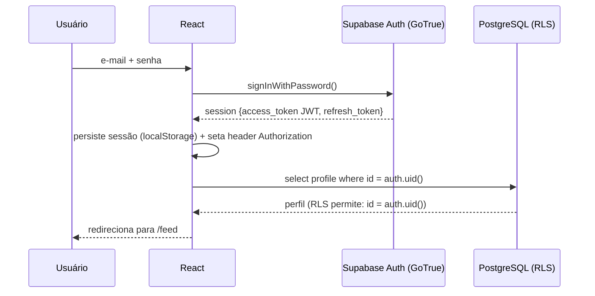

### 6.3.2. Cadastro

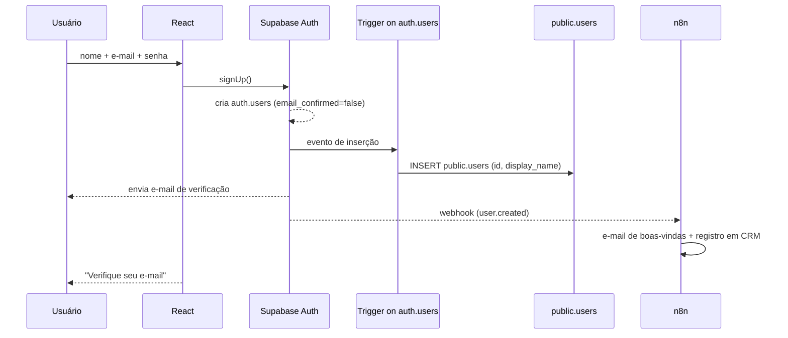

### 6.3.3. Publicação de receita

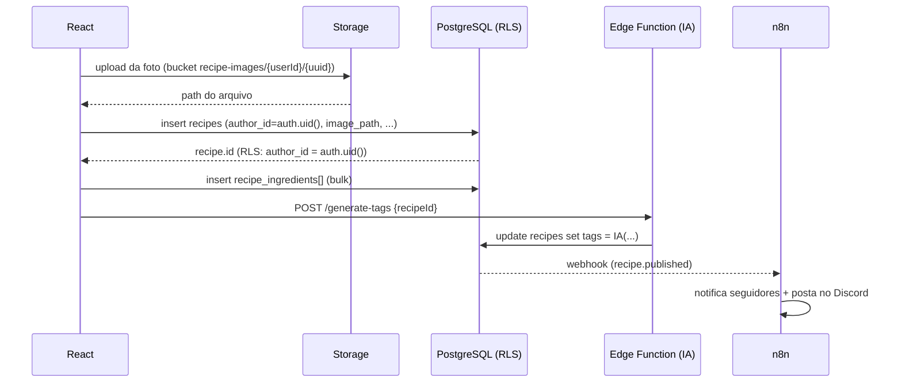

### 6.3.4. Comentários (com Realtime)

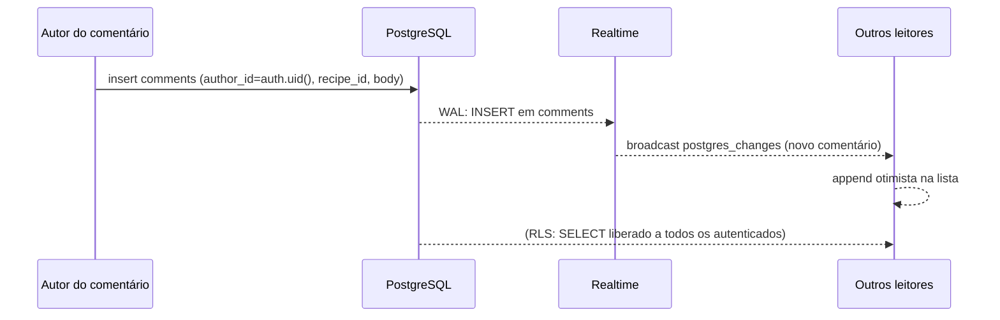

### 6.3.5. Favoritos

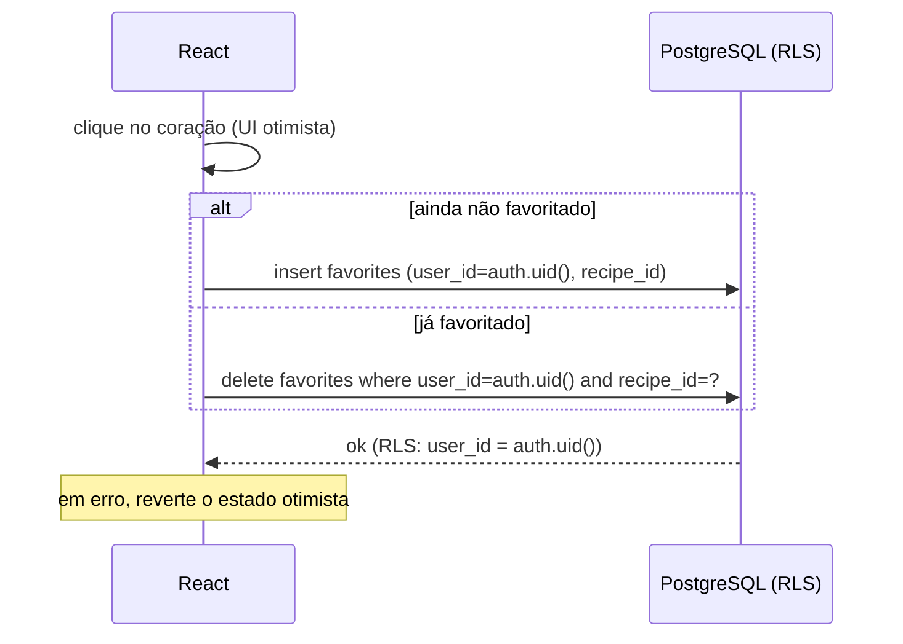

---

## 6.4. Estrutura do projeto

Organização **feature-aware** por camadas técnicas, com um diretório `supabase/`
para artefatos de banco versionados (migrations, policies, functions).

```
src/
├── assets/            # imagens estáticas, ícones, fontes
├── components/        # componentes de UI reutilizáveis (Atomic Design)
│   ├── atoms/         #   Button, Input, Avatar, StarRating
│   ├── molecules/     #   RecipeCard, CommentItem, IngredientRow
│   └── organisms/     #   RecipeList, CommentThread, Navbar
├── contexts/          # Context API: AuthContext, ThemeContext
├── hooks/             # hooks de dados/UI: useRecipes, useAuth, useFavorite
├── layouts/           # PublicLayout, AppLayout (com Navbar), AuthLayout
├── pages/             # rotas: Home, RecipeDetail, Profile, Login, NewRecipe
├── services/          # camada de acesso a dados (Repository Pattern)
│   ├── recipes.service.ts
│   ├── comments.service.ts
│   └── auth.service.ts
├── supabase/          # client + tipos gerados + helpers
│   ├── client.ts
│   └── database.types.ts   # gerado por `supabase gen types`
├── types/             # tipos de domínio (Recipe, User, Comment...)
├── utils/             # funções puras (formatDate, slugify, compressImage)
└── styles/            # tokens, globals, temas
supabase/              # (raiz) artefatos de banco versionados
├── migrations/        # *.sql idempotentes e ordenados
├── functions/         # Edge Functions (Deno)
└── seed.sql           # dados de exemplo
```

| Diretório | Responsabilidade | Regra |
|---|---|---|
| `components/` | Apresentação pura, sem acesso a dados | Recebe dados por props |
| `pages/` | Composição de rota; orquestra hooks + layout | Sem SQL/`supabase` direto |
| `hooks/` | Estado de servidor (TanStack Query) e UI | Chama `services/`, não o client cru |
| `services/` | **Único lugar que fala com o Supabase** | Repository Pattern; retorna tipos de domínio |
| `types/` | Contratos do domínio | Deriva de `database.types.ts` quando possível |
| `contexts/` | Estado global transversal (sessão, tema) | Sem lógica de dados pesada |
| `supabase/` | Client tipado + tipos gerados | Fonte única do client |
| `utils/` | Funções puras e testáveis | Sem efeitos colaterais |
| `layouts/` | Casca visual por área | Sem regra de negócio |
| `assets/`/`styles/` | Estáticos e design tokens | — |

> **Por quê isolar `services/`:** concentrar o acesso a dados num único lugar
> permite trocar o backend (ex.: voltar para uma API REST) sem tocar em
> componentes, e torna o mock em testes trivial. É o **Repository Pattern**
> aplicado ao SDK.

---

## 6.5. Banco de dados

### DER

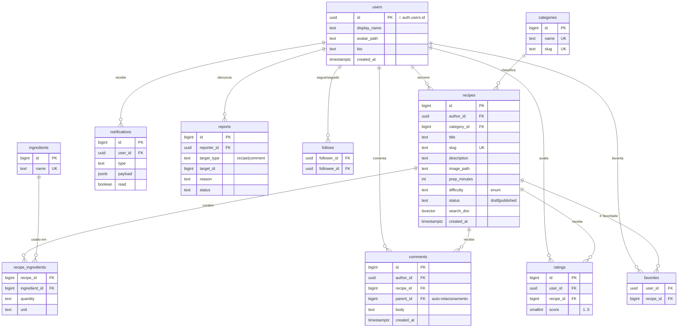

### SQL de criação (PostgreSQL / Supabase)

```sql
-- ─────────────────────────────────────────────────────────────
-- 01_schema.sql — schema do Portal de Receitas (PostgreSQL)
-- Convenções: snake_case, PK bigint identity (exceto users = uuid de auth),
-- FKs com ON DELETE explícito, timestamps timestamptz default now().
-- ─────────────────────────────────────────────────────────────

-- Perfil público (1:1 com auth.users). Não guarda senha/e-mail sensível.
create table public.users (
  id           uuid primary key references auth.users (id) on delete cascade,
  display_name text not null check (char_length(display_name) between 2 and 60),
  avatar_path  text,
  bio          text check (char_length(bio) <= 280),
  created_at   timestamptz not null default now()
);

create table public.categories (
  id   bigint generated always as identity primary key,
  name text not null unique,
  slug text not null unique
);

create type recipe_difficulty as enum ('facil', 'medio', 'dificil');
create type recipe_status     as enum ('draft', 'published');

create table public.recipes (
  id           bigint generated always as identity primary key,
  author_id    uuid not null references public.users (id) on delete cascade,
  category_id  bigint references public.categories (id) on delete set null,
  title        text not null check (char_length(title) between 3 and 140),
  slug         text not null unique,
  description  text,
  image_path   text,
  prep_minutes int check (prep_minutes >= 0),
  difficulty   recipe_difficulty not null default 'medio',
  status       recipe_status     not null default 'draft',
  search_doc   tsvector,
  created_at   timestamptz not null default now(),
  updated_at   timestamptz not null default now()
);

create table public.ingredients (
  id   bigint generated always as identity primary key,
  name text not null unique
);

-- Tabela associativa N:N receita↔ingrediente, com atributos da relação.
create table public.recipe_ingredients (
  recipe_id     bigint not null references public.recipes (id) on delete cascade,
  ingredient_id bigint not null references public.ingredients (id) on delete restrict,
  quantity      text,
  unit          text,
  primary key (recipe_id, ingredient_id)
);

create table public.ratings (
  id         bigint generated always as identity primary key,
  user_id    uuid   not null references public.users (id) on delete cascade,
  recipe_id  bigint not null references public.recipes (id) on delete cascade,
  score      smallint not null check (score between 1 and 5),
  created_at timestamptz not null default now(),
  unique (user_id, recipe_id)             -- 1 voto por usuário/receita
);

create table public.comments (
  id         bigint generated always as identity primary key,
  author_id  uuid   not null references public.users (id) on delete cascade,
  recipe_id  bigint not null references public.recipes (id) on delete cascade,
  parent_id  bigint references public.comments (id) on delete cascade, -- threads
  body       text not null check (char_length(body) between 1 and 2000),
  created_at timestamptz not null default now()
);

create table public.favorites (
  user_id    uuid   not null references public.users (id) on delete cascade,
  recipe_id  bigint not null references public.recipes (id) on delete cascade,
  created_at timestamptz not null default now(),
  primary key (user_id, recipe_id)
);

create table public.follows (
  follower_id uuid not null references public.users (id) on delete cascade,
  followee_id uuid not null references public.users (id) on delete cascade,
  created_at  timestamptz not null default now(),
  primary key (follower_id, followee_id),
  check (follower_id <> followee_id)      -- ninguém segue a si mesmo
);

create table public.notifications (
  id         bigint generated always as identity primary key,
  user_id    uuid not null references public.users (id) on delete cascade,
  type       text not null,               -- 'new_follower','new_comment',...
  payload    jsonb not null default '{}',
  read       boolean not null default false,
  created_at timestamptz not null default now()
);

create table public.reports (
  id          bigint generated always as identity primary key,
  reporter_id uuid not null references public.users (id) on delete cascade,
  target_type text not null check (target_type in ('recipe','comment')),
  target_id   bigint not null,
  reason      text not null,
  status      text not null default 'open' check (status in ('open','reviewing','closed')),
  created_at  timestamptz not null default now()
);

-- ── Índices (justificados) ───────────────────────────────────
-- Listagem por autor e por categoria (páginas de perfil e catálogo):
create index idx_recipes_author   on public.recipes (author_id);
create index idx_recipes_category on public.recipes (category_id);
-- Só receitas publicadas aparecem no catálogo → índice parcial enxuto:
create index idx_recipes_published on public.recipes (created_at desc)
  where status = 'published';
-- Busca textual (título + descrição) via GIN sobre a tsvector:
create index idx_recipes_search on public.recipes using gin (search_doc);
-- Comentários/avaliações por receita (render da página de detalhe):
create index idx_comments_recipe on public.comments (recipe_id, created_at);
create index idx_ratings_recipe  on public.ratings (recipe_id);
-- Grafo social e feed de notificações:
create index idx_follows_followee on public.follows (followee_id);
create index idx_notif_user_unread on public.notifications (user_id)
  where read = false;

-- ── Manutenção da tsvector (busca) via trigger ───────────────
create function public.recipes_tsvector_update() returns trigger
language plpgsql as $$
begin
  new.search_doc :=
    setweight(to_tsvector('portuguese', coalesce(new.title,'')), 'A') ||
    setweight(to_tsvector('portuguese', coalesce(new.description,'')), 'B');
  new.updated_at := now();
  return new;
end $$;

create trigger trg_recipes_tsvector
  before insert or update of title, description on public.recipes
  for each row execute function public.recipes_tsvector_update();
```

> **Notas de projeto.** (1) `users.id` **é** `auth.users.id` — 1:1 forte, sem
> duplicar credencial. (2) `ratings` tem `unique(user_id, recipe_id)` para impor
> "um voto por usuário". (3) `comments.parent_id` é **auto-relacionamento** para
> threads. (4) O índice **parcial** `where status='published'` é menor e mais
> rápido que um índice cheio, porque o catálogo só lê publicadas. (5) A média de
> avaliações **não** é coluna materializada aqui — é calculada por view/consulta
> (ver 6.18 para quando materializar).

---

## 6.6. Modelagem

### One-to-One (1:1) — `users` ↔ `auth.users`

Cada perfil público corresponde a exatamente um usuário de autenticação. Modela-se
com **PK que também é FK**:

```sql
-- public.users.id É a PK e ao mesmo tempo referencia auth.users.id
id uuid primary key references auth.users (id) on delete cascade
```

Por quê 1:1 e não colunas em `auth.users`: `auth.users` é gerenciada pelo
Supabase (não devemos alterá-la); o perfil público (bio, avatar, display_name)
vive em `public.users`, isolando dado de domínio do dado de identidade.

### One-to-Many (1:N) — `users` → `recipes`, `recipes` → `comments`

Um autor escreve muitas receitas; uma receita recebe muitos comentários. Modela-se
com **FK no lado "muitos"**:

```sql
-- lado "muitos" (recipes) aponta para o "um" (users)
author_id uuid not null references public.users (id) on delete cascade
-- comments aponta para recipes
recipe_id bigint not null references public.recipes (id) on delete cascade
```

`on delete cascade`: apagar o autor apaga suas receitas e comentários — coerente
com "direito ao esquecimento" (LGPD). Onde não se quer perder histórico, usar
`on delete set null` (ex.: `recipes.category_id`).

### Many-to-Many (N:N) — `recipes` ↔ `ingredients`, `users` ↔ `users` (follows)

Uma receita usa muitos ingredientes; um ingrediente aparece em muitas receitas.
Modela-se com **tabela associativa** (`recipe_ingredients`) que pode carregar
atributos da relação (`quantity`, `unit`):

```sql
primary key (recipe_id, ingredient_id)   -- par único
```

O grafo de **seguidores** é um N:N da tabela consigo mesma (`follows`), com
`follower_id` e `followee_id` ambos referenciando `users`, e `check
(follower_id <> followee_id)`.

| Relação | Tipo | Implementação |
|---|---|---|
| perfil ↔ identidade | 1:1 | PK = FK (`users.id → auth.users.id`) |
| autor → receitas | 1:N | FK em `recipes.author_id` |
| receita → comentários | 1:N | FK em `comments.recipe_id` |
| comentário → respostas | 1:N (auto) | FK em `comments.parent_id` |
| receita ↔ ingredientes | N:N | `recipe_ingredients` |
| usuário ↔ usuário (follow) | N:N (auto) | `follows` |
| usuário ↔ receita (favorito) | N:N | `favorites` |

---

## 6.7. Supabase Auth

O Supabase Auth (GoTrue) emite **JWT** assinado após login. O `supabase-js`
anexa esse token em toda requisição; a RLS lê `auth.uid()` a partir dele. Abaixo,
o client tipado e os fluxos em React.

```typescript
// src/supabase/client.ts
import { createClient } from '@supabase/supabase-js';
import type { Database } from './database.types';

export const supabase = createClient<Database>(
  import.meta.env.VITE_SUPABASE_URL,
  import.meta.env.VITE_SUPABASE_ANON_KEY,   // chave PÚBLICA (anon), nunca a service_role
  { auth: { persistSession: true, autoRefreshToken: true, detectSessionInUrl: true } },
);
```

### Cadastro e verificação de e-mail

```typescript
// src/services/auth.service.ts
import { supabase } from '../supabase/client';

export async function signUp(email: string, password: string, displayName: string) {
  const { data, error } = await supabase.auth.signUp({
    email,
    password,
    options: {
      emailRedirectTo: `${window.location.origin}/auth/callback`,
      data: { display_name: displayName },  // vai para raw_user_meta_data
    },
  });
  if (error) throw error;
  return data; // e-mail de verificação é enviado automaticamente
}
```

O perfil em `public.users` é criado por **trigger** no banco (fonte única, não
depende do cliente):

```sql
create function public.handle_new_user() returns trigger
language plpgsql security definer set search_path = public as $$
begin
  insert into public.users (id, display_name)
  values (new.id, coalesce(new.raw_user_meta_data->>'display_name', 'Chef'));
  return new;
end $$;

create trigger on_auth_user_created
  after insert on auth.users
  for each row execute function public.handle_new_user();
```

### Login, logout e sessão

```typescript
export const signIn = (email: string, password: string) =>
  supabase.auth.signInWithPassword({ email, password });

export const signOut = () => supabase.auth.signOut();

// Observa a sessão de forma reativa (usado no AuthContext)
export function onAuthChange(cb: (userId: string | null) => void) {
  return supabase.auth.onAuthStateChange((_event, session) => {
    cb(session?.user.id ?? null);
  });
}
```

### OAuth (Google e GitHub)

```typescript
export const signInWithGoogle = () =>
  supabase.auth.signInWithOAuth({
    provider: 'google',
    options: { redirectTo: `${window.location.origin}/auth/callback` },
  });

export const signInWithGitHub = () =>
  supabase.auth.signInWithOAuth({ provider: 'github' });
```

> **Configuração:** no dashboard Supabase → Authentication → Providers, habilite
> Google/GitHub e cole `Client ID`/`Secret` das respectivas consoles, com a
> **Redirect URL** `https://<ref>.supabase.co/auth/v1/callback`.

### Recuperação de senha

```typescript
// 1) dispara o e-mail com link mágico
export const requestReset = (email: string) =>
  supabase.auth.resetPasswordForEmail(email, {
    redirectTo: `${window.location.origin}/reset-password`,
  });

// 2) na página /reset-password, com sessão temporária do link:
export const updatePassword = (newPassword: string) =>
  supabase.auth.updateUser({ password: newPassword });
```

| Recurso | Método `supabase.auth` | Observação |
|---|---|---|
| Cadastro | `signUp` | Verificação de e-mail habilitável |
| Login senha | `signInWithPassword` | Retorna sessão + JWT |
| OAuth | `signInWithOAuth` | Google, GitHub, etc. |
| Logout | `signOut` | Limpa sessão local |
| Reset | `resetPasswordForEmail` + `updateUser` | Fluxo em 2 passos |
| Sessão | `getSession` / `onAuthStateChange` | Refresh automático |

---

## 6.8. Storage

Imagens de receitas e avatares ficam no **Supabase Storage** (S3 gerenciado),
organizados por bucket e prefixo por usuário — o prefixo é a base da política de
acesso.

### Organização de buckets

| Bucket | Público? | Estrutura de path | Uso |
|---|---|---|---|
| `recipe-images` | Público (leitura) | `{userId}/{recipeId}/{uuid}.webp` | Fotos das receitas |
| `avatars` | Público (leitura) | `{userId}/avatar.webp` | Foto de perfil |
| `report-evidence` | **Privado** | `{reportId}/{uuid}` | Provas de denúncia (moderação) |

### Upload com compressão no cliente

```typescript
// src/utils/compressImage.ts — reduz peso antes do upload (economia de banda/custo)
export async function compressImage(file: File, maxW = 1280, quality = 0.8): Promise<Blob> {
  const bitmap = await createImageBitmap(file);
  const scale = Math.min(1, maxW / bitmap.width);
  const canvas = new OffscreenCanvas(bitmap.width * scale, bitmap.height * scale);
  const ctx = canvas.getContext('2d')!;
  ctx.drawImage(bitmap, 0, 0, canvas.width, canvas.height);
  return canvas.convertToBlob({ type: 'image/webp', quality });
}
```

```typescript
// src/services/storage.service.ts
import { supabase } from '../supabase/client';
import { compressImage } from '../utils/compressImage';

export async function uploadRecipeImage(userId: string, recipeId: number, file: File) {
  const webp = await compressImage(file);
  const path = `${userId}/${recipeId}/${crypto.randomUUID()}.webp`;
  const { error } = await supabase.storage
    .from('recipe-images')
    .upload(path, webp, { cacheControl: '3600', upsert: false, contentType: 'image/webp' });
  if (error) throw error;
  return path; // guarde o PATH no banco, não a URL pública (permite trocar CDN)
}

export const publicUrl = (path: string) =>
  supabase.storage.from('recipe-images').getPublicUrl(path).data.publicUrl;
```

### Policy de Storage (upload só na própria pasta)

```sql
-- storage.objects é uma tabela; a policy usa o 1º segmento do path como dono.
create policy "upload na própria pasta"
on storage.objects for insert to authenticated
with check (
  bucket_id = 'recipe-images'
  and (storage.foldername(name))[1] = auth.uid()::text
);
```

### Versionamento e boas práticas

- **Nome imutável por versão** (`{uuid}.webp`): trocar a foto cria novo objeto e
  atualiza o `image_path`; evita cache velho e permite rollback.
- **Guarde o `path`, não a URL** no banco — desacopla de CDN/domínio.
- **Compressão no cliente** (WebP) reduz custo de Storage e melhora LCP.
- **Bucket privado + URL assinada** para conteúdo sensível:
  `createSignedUrl(path, 60)` gera link temporário (evidências de denúncia).
- **Limpeza:** ao deletar receita, remova os objetos (Edge Function ou n8n
  ouvindo `recipe.deleted`).

---

## 6.9. Realtime

O Realtime transmite mudanças do Postgres (via WAL) por WebSocket. Use quando o
valor de ver **ao vivo** supera o custo de manter conexões; evite quando um
`refetch` sob demanda basta.

| Caso | Usar Realtime? | Justificativa |
|---|---|---|
| **Comentários** numa receita aberta | ✅ Sim | Conversa ao vivo; alto valor percebido |
| **Notificações** (sino) | ✅ Sim | Precisa chegar sem refresh |
| **Dashboard** de moderação (denúncias) | ✅ Sim | Fila que muda por vários atores |
| **Favoritos** (contador global) | ⚠️ Evitar | Volume alto, valor baixo; prefira `refetch`/otimista |
| Catálogo/listagem geral | ❌ Não | Paginação + cache do TanStack Query resolvem |

### Exemplo: comentários ao vivo

```typescript
// src/hooks/useRecipeComments.ts
import { useEffect } from 'react';
import { useQueryClient } from '@tanstack/react-query';
import { supabase } from '../supabase/client';

export function useCommentsRealtime(recipeId: number) {
  const qc = useQueryClient();
  useEffect(() => {
    const channel = supabase
      .channel(`comments:recipe:${recipeId}`)
      .on(
        'postgres_changes',
        { event: 'INSERT', schema: 'public', table: 'comments', filter: `recipe_id=eq.${recipeId}` },
        (payload) => {
          qc.setQueryData(['comments', recipeId], (old: any[] = []) => [...old, payload.new]);
        },
      )
      .subscribe();
    return () => { supabase.removeChannel(channel); };
  }, [recipeId, qc]);
}
```

### Notificações (sino) e Dashboard

```typescript
// notificações do usuário logado
supabase.channel(`notif:${userId}`)
  .on('postgres_changes',
    { event: 'INSERT', schema: 'public', table: 'notifications', filter: `user_id=eq.${userId}` },
    (p) => toast(p.new.type))
  .subscribe();

// dashboard de moderação: novas denúncias
supabase.channel('reports:open')
  .on('postgres_changes',
    { event: 'INSERT', schema: 'public', table: 'reports' },
    (p) => queryClient.invalidateQueries({ queryKey: ['reports'] }))
  .subscribe();
```

> **Cuidado:** a RLS também vale para o Realtime — o usuário só recebe eventos de
> linhas que poderia **ler**. Habilite a publicação da tabela
> (`alter publication supabase_realtime add table public.comments`) e limite os
> filtros para não vazar volume desnecessário.

---

## 6.10. Edge Functions

São funções serverless em **Deno/TypeScript** executadas na borda, com acesso à
`service_role` (ignora RLS) de forma controlada. Use-as quando a lógica **não
pode** viver no cliente (segredos de IA, validações confiáveis, webhooks
assinados) mas precisa de resposta **síncrona** (diferente do n8n, assíncrono).

**Quando aplicar:** proteger uma API key; agregar/validar antes de gravar; receber
webhooks de terceiros; orquestrar uma chamada de IA barata e rápida.

### Exemplo 1 — Gerar tags de uma receita com IA

```typescript
// supabase/functions/generate-tags/index.ts
import { createClient } from 'jsr:@supabase/supabase-js@2';

Deno.serve(async (req) => {
  const { recipeId } = await req.json();
  const admin = createClient(
    Deno.env.get('SUPABASE_URL')!,
    Deno.env.get('SUPABASE_SERVICE_ROLE_KEY')!, // segredo, só no servidor
  );

  const { data: recipe } = await admin
    .from('recipes').select('title, description').eq('id', recipeId).single();
  if (!recipe) return new Response('not found', { status: 404 });

  const ai = await fetch('https://api.openai.com/v1/chat/completions', {
    method: 'POST',
    headers: { Authorization: `Bearer ${Deno.env.get('OPENAI_API_KEY')}`, 'Content-Type': 'application/json' },
    body: JSON.stringify({
      model: 'gpt-4o-mini',
      messages: [{ role: 'user', content: `Gere 5 tags curtas (JSON array) para: ${recipe.title}. ${recipe.description}` }],
    }),
  }).then((r) => r.json());

  const tags = JSON.parse(ai.choices[0].message.content);
  await admin.from('recipes').update({ tags }).eq('id', recipeId);
  return Response.json({ tags });
});
```

### Exemplo 2 — Média de avaliações + contagem (agregação confiável)

```typescript
// supabase/functions/recipe-stats/index.ts
import { createClient } from 'jsr:@supabase/supabase-js@2';

Deno.serve(async (req) => {
  const url = new URL(req.url);
  const recipeId = Number(url.searchParams.get('recipeId'));
  const admin = createClient(Deno.env.get('SUPABASE_URL')!, Deno.env.get('SUPABASE_SERVICE_ROLE_KEY')!);
  const { data } = await admin.rpc('recipe_rating_stats', { p_recipe_id: recipeId });
  return Response.json(data); // { average: 4.7, count: 128 }
});
```

### Exemplo 3 — Moderação de comentário no ato da criação

```typescript
// supabase/functions/moderate-comment/index.ts  (chamada pelo cliente antes de exibir)
Deno.serve(async (req) => {
  const { body } = await req.json();
  const res = await fetch('https://api.openai.com/v1/moderations', {
    method: 'POST',
    headers: { Authorization: `Bearer ${Deno.env.get('OPENAI_API_KEY')}`, 'Content-Type': 'application/json' },
    body: JSON.stringify({ input: body }),
  }).then((r) => r.json());
  const flagged = res.results[0].flagged as boolean;
  return Response.json({ allowed: !flagged, categories: res.results[0].categories });
});
```

| Aspecto | Edge Function | n8n |
|---|---|---|
| Resposta | **Síncrona** (retorna ao cliente) | Assíncrona (fire-and-forget) |
| Linguagem | TypeScript/Deno | Nós visuais / código |
| Ideal para | Segredos, validação, webhooks | Orquestração multi-serviço |
| Teste | Unitário/local (`supabase functions serve`) | Manual no editor / execuções |

---

## 6.11. Segurança

A pedra angular é a **Row Level Security (RLS)**: a autorização mora no banco, não
(só) no cliente. Se a policy nega, nem o SDK nem uma chamada crua acessam a linha.

### Habilitar RLS e policies do domínio

```sql
alter table public.recipes    enable row level security;
alter table public.comments   enable row level security;
alter table public.favorites  enable row level security;
alter table public.ratings    enable row level security;
alter table public.reports    enable row level security;
alter table public.users      enable row level security;

-- RECIPES: leitura pública só de publicadas; dono vê e edita as suas.
create policy "recipes: ler publicadas ou próprias"
on public.recipes for select using (
  status = 'published' or author_id = auth.uid()
);
create policy "recipes: autor insere as suas"
on public.recipes for insert to authenticated
with check (author_id = auth.uid());
create policy "recipes: autor edita/apaga as suas"
on public.recipes for update using (author_id = auth.uid()) with check (author_id = auth.uid());
create policy "recipes: autor apaga as suas"
on public.recipes for delete using (author_id = auth.uid());

-- COMMENTS: qualquer autenticado lê; autor gerencia o próprio.
create policy "comments: leitura autenticada" on public.comments for select to authenticated using (true);
create policy "comments: inserir como si" on public.comments for insert to authenticated with check (author_id = auth.uid());
create policy "comments: apagar o próprio" on public.comments for delete using (author_id = auth.uid());

-- FAVORITES/RATINGS: cada um só mexe nos seus.
create policy "favorites: dono" on public.favorites for all
  using (user_id = auth.uid()) with check (user_id = auth.uid());
create policy "ratings: dono" on public.ratings for all
  using (user_id = auth.uid()) with check (user_id = auth.uid());

-- USERS: perfil é público para leitura; só o dono edita.
create policy "users: leitura pública" on public.users for select using (true);
create policy "users: dono edita" on public.users for update using (id = auth.uid());
```

### Autorização por papel (moderador) — denúncias

```sql
-- Papel via custom claim no JWT (setado por hook/trigger de admin).
create policy "reports: repórter cria, moderador lê tudo"
on public.reports for select using (
  reporter_id = auth.uid()
  or coalesce((auth.jwt() -> 'app_metadata' ->> 'role'), '') = 'moderator'
);
create policy "reports: qualquer autenticado denuncia"
on public.reports for insert to authenticated with check (reporter_id = auth.uid());
```

### Ameaças e mitigações

| Ameaça | Mitigação nesta arquitetura |
|---|---|
| **SQL Injection** | PostgREST/`supabase-js` **parametrizam** tudo; nunca concatene SQL. Em Edge/RPC, use parâmetros (`rpc('fn', { p })`), nunca string interpolada |
| **XSS** | React escapa por padrão; nunca use `dangerouslySetInnerHTML` com conteúdo do usuário; sanitize markdown de comentários (`DOMPurify`) |
| **CSRF** | Auth por **JWT em header** (não cookie de sessão) elimina o vetor clássico; se usar cookies, habilite `SameSite=Lax` + verificação |
| **Escalada de acesso** | RLS em **todas** as tabelas; `service_role` **jamais** no cliente (só em Edge/n8n) |
| **Vazamento por Realtime** | Publicação restrita + RLS aplicada ao canal |
| **Abuso/força bruta** | Rate limiting (abaixo) + captcha no signup (hCaptcha do Supabase) |
| **Uploads maliciosos** | Restringir `contentType`, tamanho, e path por `auth.uid()`; varredura antivírus via n8n para buckets sensíveis |

### Rate limiting

- **Auth**: o GoTrue já limita tentativas de login/OTP por IP.
- **Escrita de conteúdo** (comentários/denúncias): impor no banco com função +
  índice, ou no gateway (n8n/Edge) com contador em `key-value`:

```sql
-- Ex.: no máx. 5 comentários por minuto por usuário (checado em trigger BEFORE INSERT)
create function public.rate_limit_comments() returns trigger language plpgsql as $$
declare recent int;
begin
  select count(*) into recent from public.comments
   where author_id = new.author_id and created_at > now() - interval '1 minute';
  if recent >= 5 then raise exception 'rate_limit: muitos comentários, aguarde'; end if;
  return new;
end $$;
create trigger trg_rl_comments before insert on public.comments
  for each row execute function public.rate_limit_comments();
```

> **Regra de ouro:** trate o cliente como **hostil**. Toda checagem que importa
> deve existir no banco (RLS/constraint/trigger) ou numa Edge Function com
> `service_role`. Validação no React é **UX**, não segurança.

---

## 6.12. Integração com React

Camadas: **service** (fala com Supabase) → **hook** (TanStack Query) →
**component/page** (UI). Estado de sessão via **Context**.

### Service (Repository Pattern)

```typescript
// src/services/recipes.service.ts
import { supabase } from '../supabase/client';
import type { Recipe } from '../types/recipe';

export const recipesService = {
  async listPublished(page = 0, size = 12): Promise<Recipe[]> {
    const from = page * size;
    const { data, error } = await supabase
      .from('recipes')
      .select('id, title, slug, image_path, difficulty, author:users(display_name)')
      .eq('status', 'published')
      .order('created_at', { ascending: false })
      .range(from, from + size - 1);
    if (error) throw error;
    return data as Recipe[];
  },
  async getBySlug(slug: string) {
    const { data, error } = await supabase
      .from('recipes')
      .select('*, ingredients:recipe_ingredients(quantity, unit, ingredient:ingredients(name))')
      .eq('slug', slug).single();
    if (error) throw error;
    return data;
  },
};
```

### Hooks com TanStack Query (cache, dedupe, otimista)

```typescript
// src/hooks/useRecipes.ts
import { useQuery, useMutation, useQueryClient, useInfiniteQuery } from '@tanstack/react-query';
import { recipesService } from '../services/recipes.service';
import { favoritesService } from '../services/favorites.service';

export const useRecipesFeed = () =>
  useInfiniteQuery({
    queryKey: ['recipes', 'feed'],
    queryFn: ({ pageParam = 0 }) => recipesService.listPublished(pageParam),
    initialPageParam: 0,
    getNextPageParam: (last, all) => (last.length === 12 ? all.length : undefined),
  });

// Favoritar com atualização otimista + rollback
export function useToggleFavorite(recipeId: number) {
  const qc = useQueryClient();
  return useMutation({
    mutationFn: (isFav: boolean) =>
      isFav ? favoritesService.remove(recipeId) : favoritesService.add(recipeId),
    onMutate: async (isFav) => {
      await qc.cancelQueries({ queryKey: ['favorite', recipeId] });
      const prev = qc.getQueryData(['favorite', recipeId]);
      qc.setQueryData(['favorite', recipeId], !isFav);
      return { prev };
    },
    onError: (_e, _v, ctx) => qc.setQueryData(['favorite', recipeId], ctx?.prev),
    onSettled: () => qc.invalidateQueries({ queryKey: ['favorite', recipeId] }),
  });
}
```

### Context de autenticação

```typescript
// src/contexts/AuthContext.tsx
import { createContext, useContext, useEffect, useState } from 'react';
import { supabase } from '../supabase/client';
import type { Session } from '@supabase/supabase-js';

const AuthContext = createContext<{ session: Session | null; loading: boolean }>({ session: null, loading: true });

export function AuthProvider({ children }: { children: React.ReactNode }) {
  const [session, setSession] = useState<Session | null>(null);
  const [loading, setLoading] = useState(true);
  useEffect(() => {
    supabase.auth.getSession().then(({ data }) => { setSession(data.session); setLoading(false); });
    const { data: sub } = supabase.auth.onAuthStateChange((_e, s) => setSession(s));
    return () => sub.subscription.unsubscribe();
  }, []);
  return <AuthContext.Provider value={{ session, loading }}>{children}</AuthContext.Provider>;
}
export const useAuth = () => useContext(AuthContext);
```

### Roteamento, lazy loading, Suspense e Error Boundary

```typescript
// src/App.tsx
import { lazy, Suspense } from 'react';
import { createBrowserRouter, RouterProvider, Navigate, Outlet } from 'react-router-dom';
import { ErrorBoundary } from 'react-error-boundary';
import { useAuth } from './contexts/AuthContext';

const Home       = lazy(() => import('./pages/Home'));
const RecipeView = lazy(() => import('./pages/RecipeView'));
const NewRecipe  = lazy(() => import('./pages/NewRecipe'));

function RequireAuth() {
  const { session, loading } = useAuth();
  if (loading) return <p>Carregando…</p>;
  return session ? <Outlet /> : <Navigate to="/login" replace />;
}

const router = createBrowserRouter([
  { path: '/', element: <Home /> },
  { path: '/receita/:slug', element: <RecipeView /> },
  { element: <RequireAuth />, children: [{ path: '/nova-receita', element: <NewRecipe /> }] },
]);

export default function App() {
  return (
    <ErrorBoundary fallback={<p>Algo deu errado. Tente recarregar.</p>}>
      <Suspense fallback={<p>Carregando…</p>}>
        <RouterProvider router={router} />
      </Suspense>
    </ErrorBoundary>
  );
}
```

| Ferramenta | Papel | Ganho |
|---|---|---|
| **TanStack Query** | Estado de servidor | Cache, dedupe, retry, otimista |
| **Context API** | Estado global leve (sessão/tema) | Sem prop-drilling |
| **React Router v6** | Rotas + guards | `RequireAuth`, nested routes |
| **lazy + Suspense** | Code splitting | Bundle menor, LCP melhor |
| **Error Boundary** | Resiliência de UI | Falha isolada, não tela branca |

---

## 6.13. n8n

n8n orquestra efeitos colaterais. Um **workflow** começa por um *trigger*
(Webhook, Cron, evento de banco) e encadeia nós de transformação e ação.

### Hospedagem — comparação

| Opção | Prós | Contras | Quando |
|---|---|---|---|
| **n8n Cloud** | Zero ops, updates automáticos | Custo mensal; menos controle | Time sem DevOps, começar rápido |
| **Railway/Render** (Docker) | Simples, barato, deploy por git | Ainda gerencia env/escala | MVP com algum controle |
| **VPS própria** (Docker Compose) | Controle total, custo fixo baixo | Você opera (backup, TLS, updates) | Volume alto, dados sensíveis |

> **Recomendação para o Portal:** iniciar em **Railway/Render** (Docker) — barato
> e reproduzível — e migrar para VPS se o volume de automações crescer.

### Conexão com o Supabase

Duas vias: (1) **HTTP Request** contra a API REST do Supabase usando a
`service_role` (guardada em credential do n8n), ou (2) nó **Postgres** conectando
direto na connection string do banco. Prefira (1) para respeitar as regras do
PostgREST; use (2) para operações em lote/relatórios.

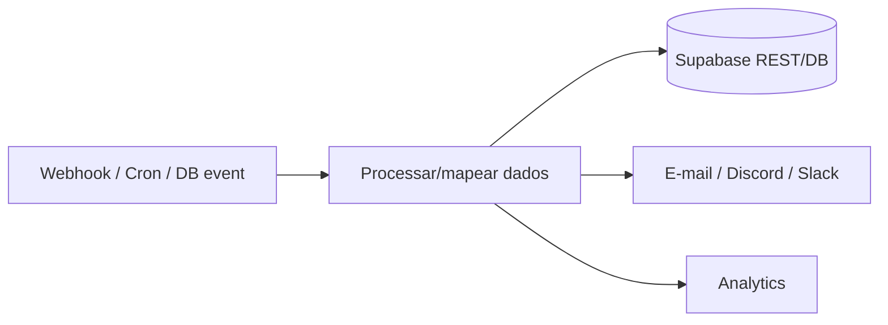

### Tipos de trigger

- **Webhook**: o Supabase (Database Webhooks) dispara em `INSERT/UPDATE` de uma
  tabela (ex.: `reports`) → URL do n8n.
- **Cron**: tarefas periódicas (ex.: resumo semanal de novas receitas).
- **Filas**: para picos, coloque um nó de fila (Redis/RabbitMQ) entre o webhook e
  o processamento, garantindo *back-pressure* e *retry*.

---

## 6.14. Automações

Três fluxos completos e distintos, todos ancorados no domínio.

### Fluxo 1 — Onboarding pós-cadastro

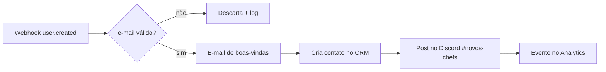
Gatilho: Database Webhook em `auth.users` (ou trigger → `net.http_post`). Passos:
validar → e-mail (SendGrid) → CRM (HubSpot) → Discord → Analytics (PostHog).

### Fluxo 2 — Moderação de denúncia

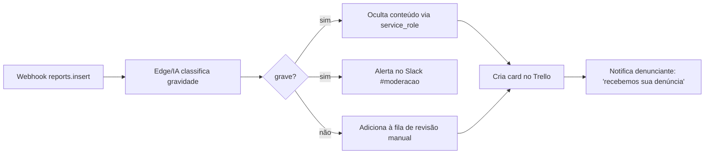
Gatilho: `INSERT` em `reports`. Automatiza triagem, ação imediata em casos graves
e rastreio (Trello), fechando o loop com o usuário.

### Fluxo 3 — Publicação de receita → distribuição

```mermaid
flowchart LR
  P[Webhook recipe.published] --> F[Busca seguidores do autor]
  F --> NO[Cria notifications[] em lote]
  NO --> RT[Realtime entrega o sino]
  P --> TG[Post no Telegram do canal]
  P --> IG[Gera legenda via IA p/ Instagram]
  P --> SE[Ping ao Google (sitemap/SEO)]
```
Gatilho: `UPDATE recipes SET status='published'`. Distribui a receita a
seguidores (notificações), redes sociais e SEO.

| Fluxo | Trigger | Serviços integrados |
|---|---|---|
| Onboarding | `user.created` | E-mail, CRM, Discord, Analytics |
| Moderação | `reports.insert` | IA, Slack, Trello, notificação |
| Publicação | `recipe.published` | Notificações, Telegram, IA, SEO |

---

## 6.15. Integração com IA

A IA entra como **Edge Function** (segredo protegido, síncrono) ou **nó do n8n**
(assíncrono, em lote). Escolha do provedor por tarefa:

| Tarefa | Provedor sugerido | Por quê |
|---|---|---|
| Geração de descrição/legenda | OpenAI `gpt-4o-mini` / Gemini Flash | Barato, criativo, rápido |
| Resumo de receita longa | Claude Haiku/Sonnet | Bom em síntese fiel |
| Criação de tags | `gpt-4o-mini` | Estruturado, saída curta |
| Correção de texto | Gemini Flash / `gpt-4o-mini` | Gramática PT-BR |
| Moderação automática | OpenAI Moderation API | Endpoint dedicado, gratuito |
| Tradução | Google Gemini / DeepL | Qualidade multilíngue |
| SEO (meta/keywords) | `gpt-4o-mini` | Estruturado |

### Exemplo — resumo + tradução (Edge Function multi-provedor)

```typescript
// supabase/functions/ai-enrich/index.ts
type Provider = 'openai' | 'gemini' | 'claude';

async function summarize(text: string, provider: Provider): Promise<string> {
  if (provider === 'claude') {
    const r = await fetch('https://api.anthropic.com/v1/messages', {
      method: 'POST',
      headers: {
        'x-api-key': Deno.env.get('ANTHROPIC_API_KEY')!,
        'anthropic-version': '2023-06-01',
        'content-type': 'application/json',
      },
      body: JSON.stringify({
        model: 'claude-haiku-4-5-20251001', max_tokens: 200,
        messages: [{ role: 'user', content: `Resuma esta receita em 2 frases:\n${text}` }],
      }),
    }).then((r) => r.json());
    return r.content[0].text;
  }
  // ...openai / gemini análogos
  return '';
}

Deno.serve(async (req) => {
  const { recipeId, provider = 'claude' } = await req.json();
  // 1) lê receita (service_role) 2) summarize 3) grava resumo + tags
  // ...
  return Response.json({ ok: true });
});
```

> **Boas práticas de IA:** (1) **nunca** exponha API keys no cliente — sempre Edge/
> n8n; (2) trate a saída como **não confiável** (valide JSON, limite tamanho);
> (3) modere entrada e saída; (4) registre custo/tokens; (5) tenha *fallback* se
> o provedor falhar; (6) marque conteúdo gerado por IA (transparência).

---

## 6.16. Deploy

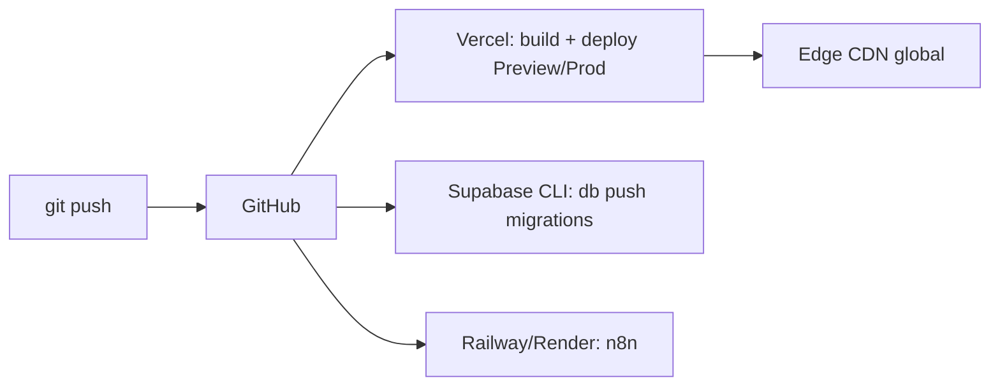

### Frontend (Vercel)

- Conecte o repositório; framework **Vite** detectado; build `npm run build`,
  output `dist/`.
- **Preview por PR** automático; produção no merge para `main`.
- Variáveis (Project → Settings → Environment Variables):

| Variável | Escopo | Valor |
|---|---|---|
| `VITE_SUPABASE_URL` | Preview+Prod | `https://<ref>.supabase.co` |
| `VITE_SUPABASE_ANON_KEY` | Preview+Prod | chave **anon** (pública) |

> **Nunca** coloque a `service_role` na Vercel do frontend — ela ignora RLS.

### Banco (Supabase) — migrations versionadas

```bash
supabase login
supabase link --project-ref <ref>
supabase db diff -f nova_feature      # gera migration a partir do schema local
supabase db push                      # aplica em staging/prod
supabase functions deploy generate-tags
supabase secrets set OPENAI_API_KEY=sk-...   # segredos das Edge Functions
```

### Automações (Railway/Render/VPS) — n8n em Docker

```yaml
# docker-compose.yml (VPS) — n8n + Postgres de estado + TLS via proxy
services:
  n8n:
    image: n8nio/n8n:latest
    environment:
      - N8N_HOST=automacoes.seudominio.com
      - N8N_PROTOCOL=https
      - WEBHOOK_URL=https://automacoes.seudominio.com/
      - DB_TYPE=postgresdb
      - DB_POSTGRESDB_HOST=postgres
      - N8N_ENCRYPTION_KEY=${N8N_ENCRYPTION_KEY}
    ports: ["5678:5678"]
    depends_on: [postgres]
  postgres:
    image: postgres:16
    environment: [POSTGRES_PASSWORD=${PG_PASS}]
    volumes: ["n8n_db:/var/lib/postgresql/data"]
volumes: { n8n_db: {} }
```

### Pipeline (GitHub Actions) — resumo

```yaml
# .github/workflows/deploy.yml
on: { push: { branches: [main] } }
jobs:
  db:
    runs-on: ubuntu-latest
    steps:
      - uses: actions/checkout@v4
      - uses: supabase/setup-cli@v1
      - run: supabase db push --db-url "${{ secrets.SUPABASE_DB_URL }}"
      - run: supabase functions deploy --project-ref ${{ secrets.SUPABASE_REF }}
  # a Vercel faz o deploy do frontend por integração nativa (sem job aqui)
```

---

## 6.17. Monitoramento

Observabilidade em três pilares: **logs**, **métricas** e **erros**, mais
**uptime** e **alertas**.

| Camada | Ferramenta | O que observar |
|---|---|---|
| Erros de frontend | **Sentry** | Exceções JS, breadcrumbs, release, usuário |
| Logs de backend | Supabase Logs (Postgres, Auth, Edge, Storage) | Queries lentas, falhas de policy, 4xx/5xx |
| Métricas de banco | Supabase Reports / `pg_stat_statements` | Top queries, cache hit, conexões |
| Analytics de produto | PostHog / Plausible | Funil cadastro→publicação, retenção |
| Uptime | UptimeRobot / Better Stack | Ping em `/` e healthcheck da Edge |
| Automações | n8n Executions + alerta em falha | Workflows que falharam, latência |

### Sentry no React

```typescript
// src/main.tsx
import * as Sentry from '@sentry/react';
Sentry.init({
  dsn: import.meta.env.VITE_SENTRY_DSN,
  environment: import.meta.env.MODE,
  tracesSampleRate: 0.1,
  integrations: [Sentry.browserTracingIntegration()],
});
```

### Alertas

- **Uptime**: alerta no Slack/Telegram se `/` ou a Edge Function ficarem fora >1min.
- **Erro em automação**: no n8n, um workflow "on error" que notifica `#alertas`.
- **Query lenta**: Supabase → Reports, revisar `pg_stat_statements` semanalmente.
- **Orçamento**: alerta de uso de Storage/Egress aproximando do limite do plano.

> **Premissa:** Sentry e PostHog têm free tier suficiente para o MVP; PostHog pode
> ser self-hosted se a política de dados exigir.

---

## 6.18. Escalabilidade

Estratégias, do barato ao avançado, com o gatilho de quando aplicar.

### Paginação e infinite scroll

Já mostrado com `useInfiniteQuery` (6.12) usando `.range(from, to)`. Para grandes
volumes, prefira **keyset pagination** (mais estável que OFFSET):

```sql
-- Página seguinte a partir do último id visto (keyset > OFFSET em tabelas grandes)
select * from public.recipes
where status = 'published' and id < :last_id
order by id desc limit 12;
```

### Índices e otimização de SQL

- Use os índices da 6.5 (parcial para publicadas, GIN para busca).
- Analise planos com `explain (analyze, buffers)`; ataque *seq scans* em filtros
  quentes.
- Evite `select *` no catálogo — projete só as colunas do card.

### Cache e CDN

| Camada | Técnica | Quando |
|---|---|---|
| Cliente | TanStack Query (`staleTime`) | Sempre; evita refetch redundante |
| Borda | CDN da Vercel (assets/HTML) | Sempre |
| Imagens | CDN do Storage + `cacheControl` | Sempre |
| Dados quentes | Materialized view (ex.: ranking) | Quando agregação pesa |

### Média de avaliações — quando materializar

Enquanto o volume é baixo, calcule por query. Ao crescer, materialize:

```sql
create materialized view public.recipe_stats as
select recipe_id, round(avg(score), 2) as average, count(*) as total
from public.ratings group by recipe_id;
create unique index on public.recipe_stats (recipe_id);
-- refresh incremental agendado por n8n Cron:
refresh materialized view concurrently public.recipe_stats;
```

### Storage, compressão e imagens

- WebP + compressão no cliente (6.8).
- `srcset`/tamanhos responsivos; `loading="lazy"` nas imagens do catálogo.
- Considere transformação de imagem sob demanda (Supabase Image Transform).

> **Ordem de ataque:** primeiro índices e projeção de colunas (barato, alto
> impacto); depois cache/CDN; só então materialização e réplicas de leitura.

---

## 6.19. Boas práticas

### SOLID e Clean Architecture aplicados

- **S**RP: `services/` só acessa dados; `hooks/` só orquestra; `components/` só
  renderizam.
- **D**IP: componentes dependem da **abstração** do service, não do `supabase-js`
  — permite trocar o backend.
- **Clean Architecture**: o domínio (`types/`, regras) não conhece o framework;
  o Supabase é um **detalhe** na borda (`services/`, `supabase/`).

### Repository Pattern

Cada agregado tem um service com interface estável (`recipesService.listPublished`,
`.getBySlug`). O componente nunca vê `.from('recipes')`.

### Estrutura por feature + Atomic Design

- **Feature-based**: agrupar por funcionalidade quando ela cresce
  (`features/recipes/{components,hooks,services}`).
- **Atomic Design**: `atoms → molecules → organisms` para UI reutilizável (6.4).

### Git: Conventional Commits, Git Flow, SemVer

```
feat(recipes): busca por ingrediente com índice GIN
fix(auth): corrige refresh de sessão ao voltar do OAuth
chore(db): migration recipe_stats materialized view
```

| Prática | Regra |
|---|---|
| **Conventional Commits** | `tipo(escopo): descrição` — habilita changelog automático |
| **Git Flow** | `main` (prod) ← `develop` ← `feature/*`; `hotfix/*` a partir de `main` |
| **SemVer** | `MAJOR.MINOR.PATCH`: breaking / feature / correção |
| **PRs pequenos** | Revisáveis, com preview da Vercel |
| **Migrations versionadas** | Nunca alterar o banco pelo dashboard em prod |

> **Regra do banco:** toda mudança de schema é uma **migration no git**. O
> dashboard é para inspeção, não para `ALTER TABLE` em produção.

---

## 6.20. Projeto final — Portal de Receitas migrado

### Funcionalidades e telas

| Tela / Rota | Função | Dados / Integração |
|---|---|---|
| `/` Home/Catálogo | Listar publicadas, buscar, filtrar, infinite scroll | `recipes` (RLS público), busca GIN |
| `/receita/:slug` Detalhe | Ingredientes, passo a passo, foto, avaliação, comentários (realtime), favoritar | `recipes`, `recipe_ingredients`, `ratings`, `comments` (Realtime), `favorites` |
| `/nova-receita` | Criar/editar receita, upload de foto, IA gera tags | `recipes`, Storage, Edge `generate-tags` |
| `/perfil/:id` | Receitas do autor, seguir/deixar de seguir | `recipes`, `follows` |
| `/login` `/cadastro` | Auth e-mail/senha + OAuth | Supabase Auth |
| `/notificacoes` | Sino com eventos ao vivo | `notifications` (Realtime) |
| `/moderacao` (moderador) | Fila de denúncias, ações | `reports` (RLS por papel), n8n |

### Fluxos e automações (consolidado)

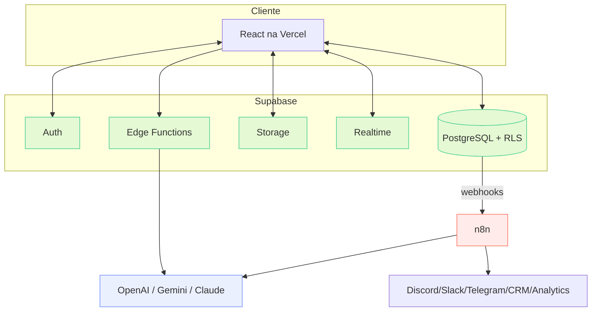

### Tabelas e processos

- **Tabelas**: `users, categories, recipes, ingredients, recipe_ingredients,
  ratings, comments, favorites, follows, notifications, reports` (6.5).
- **Processos automáticos**: perfil criado por trigger no cadastro; tags por IA
  na publicação; notificações a seguidores; moderação de denúncias; e-mails e
  distribuição social por n8n.

---

## 6.21. Roadmap de implementação

Ordem que minimiza retrabalho: banco e auth primeiro (fundação), depois leitura,
escrita, social, automação e produção.

```mermaid
gantt
  title Roadmap de migração (8 semanas)
  dateFormat  X
  axisFormat  S%L
  section Fundação
  Schema + RLS + migrations      :0, 1
  Supabase Auth + perfis         :1, 1
  section Núcleo
  Catálogo + detalhe (leitura)   :2, 1
  Publicar receita + Storage     :3, 1
  section Social
  Avaliações + comentários (RT)  :4, 1
  Favoritos + follows + notif.   :5, 1
  section Plataforma
  Edge Functions + IA + n8n      :6, 1
  Deploy + monitoramento + hardening :7, 1
```

| Semana | Entrega | Depende de |
|---|---|---|
| 1 | Schema, índices, RLS, migrations, seed | — |
| 2 | Auth (e-mail + OAuth), `AuthContext`, guards | 1 |
| 3 | Catálogo + detalhe (services, hooks, paginação) | 1–2 |
| 4 | Publicação + Storage (upload, compressão) | 3 |
| 5 | Avaliações + comentários com Realtime | 3 |
| 6 | Favoritos, follows, notificações (Realtime) | 5 |
| 7 | Edge Functions (tags/moderação IA) + n8n (onboarding, moderação, distribuição) | 4–6 |
| 8 | Deploy (Vercel/Supabase/n8n), Sentry, uptime, RLS review, testes | tudo |

---

## 6.22. Checklist final

### Banco e modelagem
- [ ] Migrations versionadas no git (nada de `ALTER` manual em prod)
- [ ] Todas as tabelas com PK, FKs e `ON DELETE` explícito
- [ ] Constraints de domínio (`check`, `unique`) aplicadas
- [ ] Índices: por FK, parcial de publicadas, GIN de busca
- [ ] Trigger de `tsvector` e de criação de perfil

### Segurança
- [ ] **RLS habilitada em todas as tabelas** e policies revisadas
- [ ] `service_role` **fora** do frontend (só Edge/n8n)
- [ ] Rate limiting em escrita de conteúdo
- [ ] Sanitização de entrada (DOMPurify) e sem `dangerouslySetInnerHTML`
- [ ] Policies de Storage por `auth.uid()`; buckets sensíveis privados
- [ ] Moderação de conteúdo (IA) no fluxo de comentários/denúncias

### Auth
- [ ] E-mail/senha + verificação de e-mail
- [ ] OAuth Google e GitHub configurados (redirect URLs)
- [ ] Recuperação de senha (2 passos)
- [ ] `onAuthStateChange` + refresh automático

### Frontend
- [ ] `services/` como única fronteira de dados (Repository Pattern)
- [ ] TanStack Query com cache, otimista e infinite scroll
- [ ] Rotas com guards, lazy loading, Suspense, Error Boundary
- [ ] Tipos gerados (`supabase gen types`) e usados

### Storage e mídia
- [ ] Compressão WebP no cliente
- [ ] Path no banco (não URL); `loading="lazy"`, `srcset`

### Realtime
- [ ] Comentários, notificações e dashboard de moderação ao vivo
- [ ] Publicação de tabelas restrita; RLS aplicada aos canais

### Edge Functions e IA
- [ ] Segredos em `supabase secrets` (nunca no cliente)
- [ ] Saída de IA validada e moderada; custo/tokens logados
- [ ] Fallback de provedor

### n8n e automações
- [ ] Hospedagem definida (Railway/Render/VPS) com `N8N_ENCRYPTION_KEY`
- [ ] Fluxos: onboarding, moderação, distribuição de publicação
- [ ] Workflow "on error" notificando alertas

### Deploy e Ops
- [ ] Vercel (Preview por PR + Prod), variáveis `VITE_*`
- [ ] `supabase db push` / `functions deploy` no pipeline
- [ ] Sentry, uptime, analytics, alertas
- [ ] Backups do Postgres verificados (restore testado)

### Qualidade
- [ ] Conventional Commits + SemVer + Git Flow
- [ ] Testes: unidade (utils/hooks), policies (pgTAP), e2e (Playwright)
- [ ] README e este guia atualizados a cada mudança estrutural

---

> **Fecho.** Esta arquitetura entrega velocidade e menos operação ao custo de
> acoplamento gerenciável (o núcleo é PostgreSQL puro) e da disciplina de manter a
> lógica de negócio bem distribuída entre **RLS** (autorização), **Edge Functions**
> (lógica confiável síncrona) e **n8n** (orquestração assíncrona). Seguindo o
> roadmap e o checklist, o Portal de Receitas migra de forma incremental e
> segura, pronto para produção.
